``` r
knitr::opts_chunk$set(echo = TRUE, fig.align = "left", fig.height = 3, fig.pos = "H", fig.width = 5,
                      message=FALSE, warning=FALSE, comment = NA)
library(pacman)
pacman::p_load(fmxdat, Texevier, knitr, kableExtra, tidyverse, dplyr, readr, covFactorModel,
               FinCovRegularization, xts, quantmod,
               lubridate, tbl2xts, corrplot, rmsfuns)

rm(list = ls()) # Cleaning environment:
gc() # garbage collection 
```

# File Overview

This README is intended to guide the reader through the code used in
completing the investigation on the use of factor modeling for
estimating the asset returns covariance matrix. The final PDF document
compiled can be found in this folder, titled “Factor Model”.

Certain sections included here, such as those discussing the process of
uploading and tidying the data, as well as the treatment of missing
values are excluded from the final PDF output, but are included here for
illustration purposes. In addition, much of the output found in this
document, and none of the code, are available in the final PDF. The
first section presents the code used in uploading and tidying the data
for both the macroeconomic factors and the asset returns. The second
consists of the introduction, as in the final PDF document, this is
followed by a brief exploratory analysis, and finally a presentation of
the empirical analysis. The final section concludes the document.

# Uploading and Tidying Data

``` r
dat_Fac <- read.csv("./data/Factors_New.csv")

dat_Factors <- dat_Fac %>%
    pivot_longer(cols = starts_with("X"), names_to="date", values_drop_na = FALSE) %>%
    pivot_wider(names_from="Indicator.Name") %>%
    mutate_at("date", str_replace, "X", "") %>%
    arrange(date) %>% mutate(date=as.yearqtr(date, format = "%Y Q%q")) %>%
    mutate(Inflation=((CPI-lag(CPI))/lag(CPI))*100) %>% 
    select(-c("CPI", "GDP.Deflator"))  # previously had experimented with calculating inflation using GDP deflator, decided CPI inflation was better choice.

### Daily Factors

US_10Yr <- read_rds("./data/bonds_10y.rds")%>%
    filter(Name=="US_10Yr") %>%
    spread(Name, Bond_10Yr) 

comms <- read_rds("./data/comms.rds")
comms <- comms %>%
    filter(Name=="Bcom_Index") %>%
    spread(Name, Price)


VIX <- read_rds("./data/IV.rds")
VIX <- VIX %>%
    filter(Name=="VIX") %>%
    spread(Name, Price)

usdzar <- read_rds("./data/usdzar.rds")
usdzar$Name <- gsub("SouthAfrica_Cncy", "USDZAR", usdzar$Name)
usdzar <- usdzar %>% spread(Name, Price)

### Full (Daily) factors convert to Quarterly
dat_Factors_K <- left_join(US_10Yr, comms, by="date") %>%
  left_join(., VIX, by="date") %>%
  left_join(., usdzar, by="date") %>%   # First, combining the relevant datasets
  mutate(Date=as.yearqtr(date)) %>%     # Second, converting to quarterly
  group_by(Date) %>%                 
  filter(date==max(date)) %>%
  ungroup() %>%
  select(Date, US_10Yr, Bcom_Index, VIX, USDZAR) %>%
  rename(., date=Date) 

### Consolidated factors dataset
Factors <- left_join(dat_Factors_K, dat_Factors, by="date")  %>%
  mutate(across(.cols=-c("date", "US_10Yr", "MM.Rate", "Inflation"), .fns = ~log(.+1)-log(lag(.+1)) )) %>% #log differences taken for relevant variables
  mutate(across(.cols=c("US_10Yr", "MM.Rate", "Inflation"), .fns= ~log(.+1))) %>% # where differences not needed to be taken, variables were still converted to log terms
  filter(date<"2021 Q4" & date>"2004 Q4")
```

``` r
new_dat_0 <- read_rds("./data/alsi.rds")

new_dat_0$Tickers <- gsub(" SJ Equity", "", new_dat_0$Tickers)  # to make life easier

# Ticker MNP classified as being in both Resources and Industrials.
new_dat_0 %>% filter(Tickers=="MNP") %>%
  select(Tickers, Superindustryname) %>%
  distinct(Tickers, Superindustryname) %>%
  kable() %>% kable_styling(latex_options = "HOLD_position")
```

<table class="table" style="margin-left: auto; margin-right: auto;">
<thead>
<tr>
<th style="text-align:left;">
Tickers
</th>
<th style="text-align:left;">
Superindustryname
</th>
</tr>
</thead>
<tbody>
<tr>
<td style="text-align:left;">
MNP
</td>
<td style="text-align:left;">
Resources
</td>
</tr>
<tr>
<td style="text-align:left;">
MNP
</td>
<td style="text-align:left;">
Industrials
</td>
</tr>
</tbody>
</table>

``` r
# According to JSE website, MNP's superindustry is industrials .. need to change this.
new_dat_0$Superindustryname[which(new_dat_0$Tickers == "MNP")] <- "Industrials"
# Checking again (with above code) confirms that MNP is now only classified as "Industrials"


# Tidying original data
new_dat <- new_dat_0 %>% 
  select(-c("Short.Name", "J203")) %>%
  mutate(Date=as.yearqtr(date)) %>%   # steps below construct the quarterly dataset to be used 
  group_by(Date) %>%                  # Macro factors only available at (minimum) quarterly frequency
  filter(date==max(date)) %>%
  ungroup() %>% 
  select(Date, Tickers, Return, Superindustryname) %>%
  rename(., date=Date) %>%
  filter(date<"2021 Q4")


T40 <- c("ABG", "AMS", "AGL", "ANG", "APN", "BHP", "BID",   # Creating vector of T40 constituents
         "BVT", "BTI", "CPI", "CLS", "CFR", "DSY", "EXX",
         "FSR", "GLN", "GFI", "GRT", "IMP", "INL", "INP",
         "MNP", "MRP", "MTN", "MCG", "NPN", "NED", "NRP",
         "NPH", "OMU", "PRX", "RNI", "SLM", "SOL", "SHP",
         "SSW", "SBK", "SPP", "VOD", "WHL")

# Final assets dataset
Assets <- new_dat %>% 
  filter(Tickers %in% T40) %>%
  select(-Superindustryname) %>%
  pivot_wider(names_from = Tickers, values_from = Return) 
  
# Separating Assets by industry

Assets_Industrial <- new_dat %>%
    filter(Tickers %in% T40) %>%
    filter(Superindustryname=="Industrials") %>%
    select(date, Tickers, Return) %>%
    pivot_wider(names_from = Tickers, values_from = Return)

Assets_Resources <- new_dat %>%
    filter(Tickers %in% T40) %>%
    filter(Superindustryname=="Resources") %>%
    select(date, Tickers, Return) %>% 
    pivot_wider(names_from = Tickers, values_from = Return) 

Assets_Financials <- new_dat %>%
    filter(Tickers %in% T40) %>%
    filter(Superindustryname=="Financials") %>%
    select(date, Tickers, Return) %>%
    pivot_wider(names_from = Tickers, values_from = Return) 


# Uncomment below to confirm number of observations (67) for each asset, same as factors

#Assets_Financials %>% gather(Tickers, Return, -date) %>% count(., Tickers)

#Assets_Industrial %>% gather(Tickers, Return, -date) %>% count(., Tickers)

#Assets_Resources %>% gather(Tickers, Return, -date) %>% count(., Tickers)

# Uncomment code below to verify that there is no overlap between variables and superindustries.

#colnames(Assets_Financials[, -1]) %in% colnames(Assets_Industrial[, -1])
#colnames(Assets_Financials[, -1]) %in% colnames(Assets_Resources[, -1])
#colnames(Assets_Resources[, -1]) %in% colnames(Assets_Industrial[, -1])
```

# Project Intro: Covariance Matrix Estimation via Macro Factor Modeling

Overall investment risk is typically classified as being either
systematic (market), affecting the broader market, or idiosyncratic
risk, which is unique to individual assets. While the latter can, in
effect, be diversified away, the former affects a large portion of
assets. Factor models can be used to explain the common (systematic)
variation in asset returns, with the remaining variance, not explained
by the factors, being unique to each individual security. Macroeconomic
factor models use observable economic time series to explain the common
variation in asset returns, with the remaining, unexplained, variance
being asset-specific. This paper presents a series of eight
macroeconomic factors to be used in studying the relationship between
macroeconomic variables and the top 40 assets on the JSE. Factor
loadings, describing each assets sensitivity to the macroeconomic
factors, are presented, along with the estimated covariance matrix of
asset returns for each super-industry, namely, the financial,
industrial, and resource sectors. The rest of the paper is outlined as
follows: Section presents a brief literature review, Section consists of
an exploratory analysis of the variables used in the study. Section
presents the results from the empirical analysis, and Section concludes.

# Literature Review 

The use of modern, multivariate, factor models can be seen as an
extension of the seminal work of @Sharpe1964’s Capital Asset Pricing
Model (CAPM), which used a single factor- the market portfolio- to
estimate asset returns. In most cases, however, there are potentially,
infinitely, many factors which can influence asset returns. Modern
factor models allow one to address the curse of dimensionality by
assuming stock returns are driven by a, more, limited set of factors.
Factor models thus decompose asset returns into two components: one
driven by the common variation between stocks, due to the factors, and
another idiosyncratic component, unique to each asset. Using a factor
model can therefore be a useful way of reducing the number of possible
parameters which can, possibly, drive asset returns; assuming that what
is not explained by the, common, factors is idiosyncratic risk unique to
each asset.

Factor models have gained in prominence since @Sharpe1964, and have been
extended to include more than one factor. In particular, this class of
models can generally be split into three types \[@Connor\];
macroeconomic, statistical, and fundamental factor models. Whilst
statistical factor models use only the input (data) to determine the
relevant factors for asset returns, macroeceonmic and fundamental factor
models rely on the researcher to supplement the asset returns data with
factors. One of the most prominent fundamental factor model was
developed by @Fama1992, who use firm-specific variables including
relevant firm financial ratios, firm-size, and market beta in order to
explain the variation in asset returns.

In using macroeconomic factor models to study the behavior of asset
returns, @Chen1986 propose a set of candidate economic variables as
factors to explain systematic asset risk. They found that industrial
production, changes in risk premium, some measures of inflation, and
changes in the yield curve were all significant in explaining expected
asset returns. In a similar vein, @Kim1987 find that an economic factor
model, generally, performs better than a multivariate CAPM. The factors
that they found to be significant were split into three categories:
general, economy-wide, variables, the second category focused on the
monetary side of the economy and included the interest rate and money
supply. And the final factor comprised of labor market variables.

# Exploratory Analysis 

## Data and Descriptive Statistics

``` r
# Creating Table with Variable Descriptions
Fac_Names <- colnames(Factors[, -1])
Fac_Desc <- c("US 10 Year Bond Yields", "Bloomberg Commodities Index", "CBOE Volatility Index", "USD/ZAR Spot Price", "SA Money Market Rate", "SA Real Gross Domestic Product", "SA Real Gross Fixed Capital Formation", "Inflation (Consumer Prices)")
Fac_Source <- c("N. Katzke", "N. Katzke", "N. Katzke", "N. Katzke", "IMF International Financial Statistics", "IMF International Financial Statistics", "IMF International Financial Statistics", "IMF International Financial Statistics")

data.frame(Fac_Names, Fac_Desc, Fac_Source) %>% arrange(Fac_Names) %>% kable(caption="Macroeconomic Factors", align="l", col.names = c("Name", "Description", "Source")) #%>%  kable_styling(latex_options = "HOLD_position")
```

<table>
<caption>
Macroeconomic Factors
</caption>
<thead>
<tr>
<th style="text-align:left;">
Name
</th>
<th style="text-align:left;">
Description
</th>
<th style="text-align:left;">
Source
</th>
</tr>
</thead>
<tbody>
<tr>
<td style="text-align:left;">
Bcom_Index
</td>
<td style="text-align:left;">
Bloomberg Commodities Index
</td>
<td style="text-align:left;">
N. Katzke
</td>
</tr>
<tr>
<td style="text-align:left;">
Inflation
</td>
<td style="text-align:left;">
Inflation (Consumer Prices)
</td>
<td style="text-align:left;">
IMF International Financial Statistics
</td>
</tr>
<tr>
<td style="text-align:left;">
MM.Rate
</td>
<td style="text-align:left;">
SA Money Market Rate
</td>
<td style="text-align:left;">
IMF International Financial Statistics
</td>
</tr>
<tr>
<td style="text-align:left;">
Real.GDP
</td>
<td style="text-align:left;">
SA Real Gross Domestic Product
</td>
<td style="text-align:left;">
IMF International Financial Statistics
</td>
</tr>
<tr>
<td style="text-align:left;">
Real.INV
</td>
<td style="text-align:left;">
SA Real Gross Fixed Capital Formation
</td>
<td style="text-align:left;">
IMF International Financial Statistics
</td>
</tr>
<tr>
<td style="text-align:left;">
US_10Yr
</td>
<td style="text-align:left;">
US 10 Year Bond Yields
</td>
<td style="text-align:left;">
N. Katzke
</td>
</tr>
<tr>
<td style="text-align:left;">
USDZAR
</td>
<td style="text-align:left;">
USD/ZAR Spot Price
</td>
<td style="text-align:left;">
N. Katzke
</td>
</tr>
<tr>
<td style="text-align:left;">
VIX
</td>
<td style="text-align:left;">
CBOE Volatility Index
</td>
<td style="text-align:left;">
N. Katzke
</td>
</tr>
</tbody>
</table>

Macroeconomic factors for South Africa were chosen on the basis of their
possible influence in driving asset returns in South Africa. US 10 Year
bond yields were used to quantify the influence of US Monetary Policy
decisions in driving global liquidity. This is based on the direct
relationship between bond yields and interest rates, whereby lower
interest rates depress bond yields and these thus become a less
attractive investment option; potentially leading investors to seek
higher returns in domestic and foreign asset markets. The Bloomberg
commodities index was used to measure the influence that changing
commodity prices may have on asset returns, given that the South African
economy is still influenced to a large extent by fluctuating commodity
prices. The CBOE VIX volatility index was included to account for the
effect that changing risk perceptions may have on domestic asset
returns. Similarly to changes in US long term bond yields, lower risk
perceptions may lead to capital flowing more towards developing
(periphery) and could thus influence South African asset returns. The
USDZAR spot rate was also included as changes in the price of foreign
exchange can influence asset returns through, for example, increasing
the cost of financing outstanding debt, or increasing input costs. The
money market rate was used to represent the domestic monetary policy
stance, this can affect the cost of borrowing for businesses, as well as
changing investor incentives when it comes to investing in asset
markets; both of which can influence returns. Real gross fixed capital
formation was used to account for the level of investment in the economy
for any given quarter. Finally, inflation was measured using the
Consumer Price Index (CPI) and the formula
$Inflation\_{t}=\\frac{CPI\_{t}-CPI\_{t-1}}{CPI\_{t-1}}$. All macro
factors entered the model in log terms, and, in addition, non-stationary
variables were taken as quarterly changes.

Descriptive statistics for the macroeconomic factors can be seen in the
table below.

``` r
# Creating Table with descriptive statistics for Macro Factors
data.frame(pastecs::stat.desc(Factors[, -1], basic=F)) %>% 
  kable(caption="Summary Statistics: Macroeconomic Factors", digits=4, align="l", longtable=TRUE)#%>%  kable_styling(latex_options = "HOLD_position")
```

<table>
<caption>
Summary Statistics: Macroeconomic Factors
</caption>
<thead>
<tr>
<th style="text-align:left;">
</th>
<th style="text-align:left;">
US_10Yr
</th>
<th style="text-align:left;">
Bcom_Index
</th>
<th style="text-align:left;">
VIX
</th>
<th style="text-align:left;">
USDZAR
</th>
<th style="text-align:left;">
MM.Rate
</th>
<th style="text-align:left;">
Real.GDP
</th>
<th style="text-align:left;">
Real.INV
</th>
<th style="text-align:left;">
Inflation
</th>
</tr>
</thead>
<tbody>
<tr>
<td style="text-align:left;">
median
</td>
<td style="text-align:left;">
1.2499
</td>
<td style="text-align:left;">
0.0034
</td>
<td style="text-align:left;">
-0.0274
</td>
<td style="text-align:left;">
0.0034
</td>
<td style="text-align:left;">
2.0189
</td>
<td style="text-align:left;">
0.0087
</td>
<td style="text-align:left;">
0.0109
</td>
<td style="text-align:left;">
0.8047
</td>
</tr>
<tr>
<td style="text-align:left;">
mean
</td>
<td style="text-align:left;">
1.2736
</td>
<td style="text-align:left;">
-0.0054
</td>
<td style="text-align:left;">
0.0078
</td>
<td style="text-align:left;">
0.0131
</td>
<td style="text-align:left;">
1.9878
</td>
<td style="text-align:left;">
0.0044
</td>
<td style="text-align:left;">
0.0033
</td>
<td style="text-align:left;">
0.7862
</td>
</tr>
<tr>
<td style="text-align:left;">
SE.mean
</td>
<td style="text-align:left;">
0.0383
</td>
<td style="text-align:left;">
0.0121
</td>
<td style="text-align:left;">
0.0399
</td>
<td style="text-align:left;">
0.0084
</td>
<td style="text-align:left;">
0.0293
</td>
<td style="text-align:left;">
0.0037
</td>
<td style="text-align:left;">
0.0053
</td>
<td style="text-align:left;">
0.0378
</td>
</tr>
<tr>
<td style="text-align:left;">
CI.mean.0.95
</td>
<td style="text-align:left;">
0.0765
</td>
<td style="text-align:left;">
0.0243
</td>
<td style="text-align:left;">
0.0796
</td>
<td style="text-align:left;">
0.0168
</td>
<td style="text-align:left;">
0.0585
</td>
<td style="text-align:left;">
0.0073
</td>
<td style="text-align:left;">
0.0106
</td>
<td style="text-align:left;">
0.0755
</td>
</tr>
<tr>
<td style="text-align:left;">
var
</td>
<td style="text-align:left;">
0.0984
</td>
<td style="text-align:left;">
0.0099
</td>
<td style="text-align:left;">
0.1066
</td>
<td style="text-align:left;">
0.0048
</td>
<td style="text-align:left;">
0.0575
</td>
<td style="text-align:left;">
0.0009
</td>
<td style="text-align:left;">
0.0019
</td>
<td style="text-align:left;">
0.0959
</td>
</tr>
<tr>
<td style="text-align:left;">
std.dev
</td>
<td style="text-align:left;">
0.3137
</td>
<td style="text-align:left;">
0.0994
</td>
<td style="text-align:left;">
0.3264
</td>
<td style="text-align:left;">
0.0689
</td>
<td style="text-align:left;">
0.2398
</td>
<td style="text-align:left;">
0.0301
</td>
<td style="text-align:left;">
0.0436
</td>
<td style="text-align:left;">
0.3097
</td>
</tr>
<tr>
<td style="text-align:left;">
coef.var
</td>
<td style="text-align:left;">
0.2463
</td>
<td style="text-align:left;">
-18.2426
</td>
<td style="text-align:left;">
41.7157
</td>
<td style="text-align:left;">
5.2485
</td>
<td style="text-align:left;">
0.1206
</td>
<td style="text-align:left;">
6.8272
</td>
<td style="text-align:left;">
13.3623
</td>
<td style="text-align:left;">
0.3939
</td>
</tr>
</tbody>
</table>

For this analysis, only variables in the Top 40 of the JSE, by market
capitalization, were included. This was done to account for the fact
that larger companies will be more exposed to global macroeconomic
factors, relative to those with smaller market caps. The variables
chosen as part of this “T40” are based on the FTSE Russell
classification, as of the end of 2021 Q4 (see \[@FTSE\]). After
subsetting the Top 40 stocks, these were stratified into their
respective super-industries. When constructing the dataset by industry
classification, Mondi PLC (MNP) had the majority of it’s observations
classified as being in resources, rather than the industrial sector the
JSE claims it belongs to. As such, MNP was reclassified as being part of
Industrials. The stocks included, as well as their relevant industries,
can be found in the table below.

``` r
# Creating Descriptive Table of T40 stocks and Industries
new_dat_0 %>% filter(Tickers %in% T40) %>%
  filter(Superindustryname=="Financials") %>%
  distinct(Tickers, Short.Name) %>%
  arrange(Short.Name) %>%
  kable(caption="T40 Constituents: Financials", align="l", col.names = c("Ticker", "Constituent")) #%>% kable_styling(latex_options = "HOLD_position")
```

<table>
<caption>
T40 Constituents: Financials
</caption>
<thead>
<tr>
<th style="text-align:left;">
Ticker
</th>
<th style="text-align:left;">
Constituent
</th>
</tr>
</thead>
<tbody>
<tr>
<td style="text-align:left;">
ABG
</td>
<td style="text-align:left;">
ABSA GROUP LTD
</td>
</tr>
<tr>
<td style="text-align:left;">
CPI
</td>
<td style="text-align:left;">
CAPITEC BANK HOL
</td>
</tr>
<tr>
<td style="text-align:left;">
DSY
</td>
<td style="text-align:left;">
DISCOVERY LTD
</td>
</tr>
<tr>
<td style="text-align:left;">
FSR
</td>
<td style="text-align:left;">
FIRSTRAND LTD
</td>
</tr>
<tr>
<td style="text-align:left;">
GRT
</td>
<td style="text-align:left;">
GROWTHPOINT PROP
</td>
</tr>
<tr>
<td style="text-align:left;">
INL
</td>
<td style="text-align:left;">
INVESTEC LTD
</td>
</tr>
<tr>
<td style="text-align:left;">
INP
</td>
<td style="text-align:left;">
INVESTEC PLC
</td>
</tr>
<tr>
<td style="text-align:left;">
NED
</td>
<td style="text-align:left;">
NEDBANK GROUP
</td>
</tr>
<tr>
<td style="text-align:left;">
NRP
</td>
<td style="text-align:left;">
NEPI ROCKCASTLE
</td>
</tr>
<tr>
<td style="text-align:left;">
OMU
</td>
<td style="text-align:left;">
OLD MUTUAL LTD
</td>
</tr>
<tr>
<td style="text-align:left;">
RNI
</td>
<td style="text-align:left;">
Reinet Investments SCA
</td>
</tr>
<tr>
<td style="text-align:left;">
SLM
</td>
<td style="text-align:left;">
SANLAM LTD
</td>
</tr>
<tr>
<td style="text-align:left;">
SBK
</td>
<td style="text-align:left;">
STANDARD BANK GR
</td>
</tr>
</tbody>
</table>

``` r
new_dat_0 %>% filter(Tickers %in% T40) %>%
  filter(Superindustryname=="Industrials") %>%
  distinct(Tickers, Short.Name) %>%
  arrange(Short.Name) %>%
  kable(caption="T40 Constituents: Industrials", align="l", col.names = c("Ticker", "Constituent")) #%>% kable_styling(latex_options = "HOLD_position")
```

<table>
<caption>
T40 Constituents: Industrials
</caption>
<thead>
<tr>
<th style="text-align:left;">
Ticker
</th>
<th style="text-align:left;">
Constituent
</th>
</tr>
</thead>
<tbody>
<tr>
<td style="text-align:left;">
APN
</td>
<td style="text-align:left;">
ASPEN PHARMACARE
</td>
</tr>
<tr>
<td style="text-align:left;">
BID
</td>
<td style="text-align:left;">
BID CORP LTD
</td>
</tr>
<tr>
<td style="text-align:left;">
BVT
</td>
<td style="text-align:left;">
BIDVEST GROUP
</td>
</tr>
<tr>
<td style="text-align:left;">
BTI
</td>
<td style="text-align:left;">
BRIT AMER TOBACC
</td>
</tr>
<tr>
<td style="text-align:left;">
CLS
</td>
<td style="text-align:left;">
CLICKS GROUP LTD
</td>
</tr>
<tr>
<td style="text-align:left;">
MNP
</td>
<td style="text-align:left;">
MONDI PLC
</td>
</tr>
<tr>
<td style="text-align:left;">
MRP
</td>
<td style="text-align:left;">
MR PRICE GROUP
</td>
</tr>
<tr>
<td style="text-align:left;">
MTN
</td>
<td style="text-align:left;">
MTN GROUP LTD
</td>
</tr>
<tr>
<td style="text-align:left;">
MCG
</td>
<td style="text-align:left;">
MULTICHOICE GROU
</td>
</tr>
<tr>
<td style="text-align:left;">
NPN
</td>
<td style="text-align:left;">
NASPERS LTD-N
</td>
</tr>
<tr>
<td style="text-align:left;">
PRX
</td>
<td style="text-align:left;">
PROSUS NV
</td>
</tr>
<tr>
<td style="text-align:left;">
CFR
</td>
<td style="text-align:left;">
RICHEMONT-DR
</td>
</tr>
<tr>
<td style="text-align:left;">
SHP
</td>
<td style="text-align:left;">
SHOPRITE HLDGS
</td>
</tr>
<tr>
<td style="text-align:left;">
SPP
</td>
<td style="text-align:left;">
SPAR GRP LTD/THE
</td>
</tr>
<tr>
<td style="text-align:left;">
VOD
</td>
<td style="text-align:left;">
VODACOM GROUP
</td>
</tr>
<tr>
<td style="text-align:left;">
WHL
</td>
<td style="text-align:left;">
WOOLWORTHS HLDGS
</td>
</tr>
</tbody>
</table>

``` r
new_dat_0 %>% filter(Tickers %in% T40) %>%
  filter(Superindustryname=="Resources") %>%
  distinct(Tickers, Short.Name) %>%
  arrange(Short.Name) %>%
  kable(caption="T40 Constituents: Resources", align="l", col.names = c("Ticker", "Constituent")) #%>% kable_styling(latex_options = "HOLD_position")
```

<table>
<caption>
T40 Constituents: Resources
</caption>
<thead>
<tr>
<th style="text-align:left;">
Ticker
</th>
<th style="text-align:left;">
Constituent
</th>
</tr>
</thead>
<tbody>
<tr>
<td style="text-align:left;">
AGL
</td>
<td style="text-align:left;">
ANGLO AMER PLC
</td>
</tr>
<tr>
<td style="text-align:left;">
AMS
</td>
<td style="text-align:left;">
ANGLO AMERICAN P
</td>
</tr>
<tr>
<td style="text-align:left;">
ANG
</td>
<td style="text-align:left;">
ANGLOGOLD ASHANT
</td>
</tr>
<tr>
<td style="text-align:left;">
BHP
</td>
<td style="text-align:left;">
BHP GROUP PLC
</td>
</tr>
<tr>
<td style="text-align:left;">
EXX
</td>
<td style="text-align:left;">
EXXARO RESOURCES
</td>
</tr>
<tr>
<td style="text-align:left;">
GLN
</td>
<td style="text-align:left;">
GLENCORE PLC
</td>
</tr>
<tr>
<td style="text-align:left;">
GFI
</td>
<td style="text-align:left;">
GOLD FIELDS LTD
</td>
</tr>
<tr>
<td style="text-align:left;">
IMP
</td>
<td style="text-align:left;">
IMPALA PLATINUM
</td>
</tr>
<tr>
<td style="text-align:left;">
NPH
</td>
<td style="text-align:left;">
NORTHAM PLATINUM
</td>
</tr>
<tr>
<td style="text-align:left;">
SOL
</td>
<td style="text-align:left;">
SASOL LTD
</td>
</tr>
<tr>
<td style="text-align:left;">
SSW
</td>
<td style="text-align:left;">
SIBANYE STILLWAT
</td>
</tr>
</tbody>
</table>

### Treatment of Missing Values

The code below was run in order to check if there were missing values in
the asset returns dataset, with column “n” representing the number of
missing values.

``` r
# Checking number of NA's for each asset
data.frame(colSums(is.na(Assets[, -1])))%>% kable(caption="Assets Missing Values", align="l", col.names = "n") #%>% kable_styling(latex_options = "HOLD_position") 
```

<table>
<caption>
Assets Missing Values
</caption>
<thead>
<tr>
<th style="text-align:left;">
</th>
<th style="text-align:left;">
n
</th>
</tr>
</thead>
<tbody>
<tr>
<td style="text-align:left;">
AGL
</td>
<td style="text-align:left;">
0
</td>
</tr>
<tr>
<td style="text-align:left;">
BHP
</td>
<td style="text-align:left;">
0
</td>
</tr>
<tr>
<td style="text-align:left;">
CFR
</td>
<td style="text-align:left;">
0
</td>
</tr>
<tr>
<td style="text-align:left;">
SOL
</td>
<td style="text-align:left;">
0
</td>
</tr>
<tr>
<td style="text-align:left;">
SBK
</td>
<td style="text-align:left;">
0
</td>
</tr>
<tr>
<td style="text-align:left;">
MTN
</td>
<td style="text-align:left;">
0
</td>
</tr>
<tr>
<td style="text-align:left;">
FSR
</td>
<td style="text-align:left;">
0
</td>
</tr>
<tr>
<td style="text-align:left;">
ABG
</td>
<td style="text-align:left;">
0
</td>
</tr>
<tr>
<td style="text-align:left;">
GFI
</td>
<td style="text-align:left;">
0
</td>
</tr>
<tr>
<td style="text-align:left;">
IMP
</td>
<td style="text-align:left;">
0
</td>
</tr>
<tr>
<td style="text-align:left;">
SLM
</td>
<td style="text-align:left;">
0
</td>
</tr>
<tr>
<td style="text-align:left;">
ANG
</td>
<td style="text-align:left;">
0
</td>
</tr>
<tr>
<td style="text-align:left;">
NPN
</td>
<td style="text-align:left;">
0
</td>
</tr>
<tr>
<td style="text-align:left;">
BVT
</td>
<td style="text-align:left;">
0
</td>
</tr>
<tr>
<td style="text-align:left;">
AMS
</td>
<td style="text-align:left;">
0
</td>
</tr>
<tr>
<td style="text-align:left;">
NED
</td>
<td style="text-align:left;">
0
</td>
</tr>
<tr>
<td style="text-align:left;">
INP
</td>
<td style="text-align:left;">
0
</td>
</tr>
<tr>
<td style="text-align:left;">
WHL
</td>
<td style="text-align:left;">
0
</td>
</tr>
<tr>
<td style="text-align:left;">
EXX
</td>
<td style="text-align:left;">
0
</td>
</tr>
<tr>
<td style="text-align:left;">
APN
</td>
<td style="text-align:left;">
0
</td>
</tr>
<tr>
<td style="text-align:left;">
INL
</td>
<td style="text-align:left;">
0
</td>
</tr>
<tr>
<td style="text-align:left;">
SHP
</td>
<td style="text-align:left;">
0
</td>
</tr>
<tr>
<td style="text-align:left;">
GRT
</td>
<td style="text-align:left;">
0
</td>
</tr>
<tr>
<td style="text-align:left;">
SPP
</td>
<td style="text-align:left;">
0
</td>
</tr>
<tr>
<td style="text-align:left;">
DSY
</td>
<td style="text-align:left;">
0
</td>
</tr>
<tr>
<td style="text-align:left;">
CLS
</td>
<td style="text-align:left;">
0
</td>
</tr>
<tr>
<td style="text-align:left;">
MRP
</td>
<td style="text-align:left;">
0
</td>
</tr>
<tr>
<td style="text-align:left;">
CPI
</td>
<td style="text-align:left;">
0
</td>
</tr>
<tr>
<td style="text-align:left;">
NPH
</td>
<td style="text-align:left;">
0
</td>
</tr>
<tr>
<td style="text-align:left;">
MNP
</td>
<td style="text-align:left;">
10
</td>
</tr>
<tr>
<td style="text-align:left;">
BTI
</td>
<td style="text-align:left;">
15
</td>
</tr>
<tr>
<td style="text-align:left;">
VOD
</td>
<td style="text-align:left;">
17
</td>
</tr>
<tr>
<td style="text-align:left;">
SSW
</td>
<td style="text-align:left;">
32
</td>
</tr>
<tr>
<td style="text-align:left;">
GLN
</td>
<td style="text-align:left;">
35
</td>
</tr>
<tr>
<td style="text-align:left;">
BID
</td>
<td style="text-align:left;">
45
</td>
</tr>
<tr>
<td style="text-align:left;">
NRP
</td>
<td style="text-align:left;">
50
</td>
</tr>
<tr>
<td style="text-align:left;">
RNI
</td>
<td style="text-align:left;">
51
</td>
</tr>
<tr>
<td style="text-align:left;">
OMU
</td>
<td style="text-align:left;">
53
</td>
</tr>
<tr>
<td style="text-align:left;">
MCG
</td>
<td style="text-align:left;">
56
</td>
</tr>
<tr>
<td style="text-align:left;">
PRX
</td>
<td style="text-align:left;">
58
</td>
</tr>
</tbody>
</table>

Removing the data was done as in the chunk below. Firstly, for each
industry, assets which had more than 70% of observations missing were
dropped. The reason for this is that the second step involves imputing
the missing returns from the distribution of asset i’s returns. Having a
high proportion of missing observations would inevitably lead to biased
results from using the “missingreturns” function.

``` r
# Cleaning data and creating log returns series
source("./code/missingreturns.R")

# Assets split by industry
## First select assets with less than 30% of observations missing. Then impute missing values using the above (sourced) function.
## Finally, take logs of the returns, use log(x+1) to account for periods with zero returns.

Financials_clean <- Assets_Financials %>% 
  select(where(~mean(is.na(.))< 0.7)) %>% 
  impute_missing_returns(., impute_returns_method = "Drawn_Distribution_Own", Seed = as.numeric(format( Sys.time(), "%Y%d%H%M"))) %>%
  mutate(across(.cols=-date, .fns=~log(.+1))) 

Industrial_clean <- Assets_Industrial %>% 
  select(where(~mean(is.na(.))< 0.7)) %>% 
  impute_missing_returns(., impute_returns_method = "Drawn_Distribution_Own", Seed = as.numeric(format( Sys.time(), "%Y%d%H%M"))) %>%
  mutate(across(.cols=-date, .fns=~log(.+1))) 

Resources_clean <- Assets_Resources %>% 
  select(where(~mean(is.na(.))< 0.7)) %>%
  impute_missing_returns(., impute_returns_method = "Drawn_Distribution_Own", Seed = as.numeric(format( Sys.time(), "%Y%d%H%M"))) %>%
  mutate(across(.cols=-date, .fns=~log(.+1))) 
```

From the table below, one can see the 5 tickers that dropped out of the
final asset returns dataset. Tickers NRP, OMU, RNI, MCG, PRX dropping
out, with the former 3 being part of the financials group, and the
latter 2 belonging to industrials.

``` r
# Checking which assets dropped out

T40[!T40%in%colnames(Assets[, -1] %>% select(where(~mean(is.na(.))< 0.7)))] %>% kable(caption="Assets Removed Variables", align="l", col.names = "Tickers") #%>% kable_styling(latex_options = "HOLD_position")
```

<table>
<caption>
Assets Removed Variables
</caption>
<thead>
<tr>
<th style="text-align:left;">
Tickers
</th>
</tr>
</thead>
<tbody>
<tr>
<td style="text-align:left;">
MCG
</td>
</tr>
<tr>
<td style="text-align:left;">
NRP
</td>
</tr>
<tr>
<td style="text-align:left;">
OMU
</td>
</tr>
<tr>
<td style="text-align:left;">
PRX
</td>
</tr>
<tr>
<td style="text-align:left;">
RNI
</td>
</tr>
</tbody>
</table>

## Data Visualization

This section presents figures for the relevant macroeconomic factors,
and the asset returns (disaggregated) by industry.

``` r
p.US <- Factors %>% mutate(date=as.Date(date)) %>% ggplot() + geom_line(aes(date, US_10Yr)) + labs(x="", y="", title="US 10Year") + theme_bw()

fmxdat::finplot(p.US, x.vert = T, x.date.type = "%Y", x.date.dist="2 year", y.comma.sep=TRUE)
```

<div class="figure" style="text-align: left">

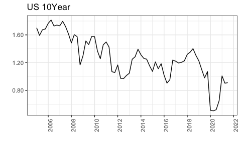
<p class="caption">
US Long-Term Bond Yields
</p>

</div>

``` r
p.USDZAR <- Factors %>% mutate(date=as.Date(date)) %>% ggplot() + geom_line(aes(date, USDZAR)) + labs(x="", y="", title="USDZAR") + theme_bw()

fmxdat::finplot(p.USDZAR, x.vert = T, x.date.type = "%Y", x.date.dist="2 year", y.comma.sep=TRUE)
```

<div class="figure" style="text-align: left">

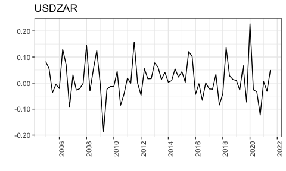
<p class="caption">
USDZAR Spot Price
</p>

</div>

``` r
p.VIX <- Factors %>% mutate(date=as.Date(date)) %>% ggplot() + geom_line(aes(date, VIX)) + labs(x="", y="", title="VIX Volatility") + theme_bw()

fmxdat::finplot(p.VIX, x.vert = T, x.date.type = "%Y", x.date.dist="2 year", y.comma.sep=TRUE)
```

<div class="figure" style="text-align: left">

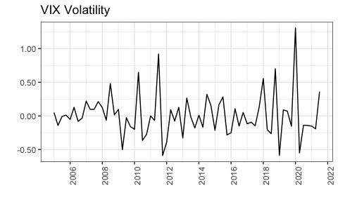
<p class="caption">
CBOE VIX Volatility Index
</p>

</div>

``` r
p.Bcom_Index <- Factors %>% mutate(date=as.Date(date)) %>% ggplot() + geom_line(aes(date, Bcom_Index)) + labs(x="", y="", title="Commodity Price") + theme_bw()

fmxdat::finplot(p.Bcom_Index, x.vert = T, x.date.type = "%Y", x.date.dist="2 year", y.comma.sep=TRUE)
```

<div class="figure" style="text-align: left">

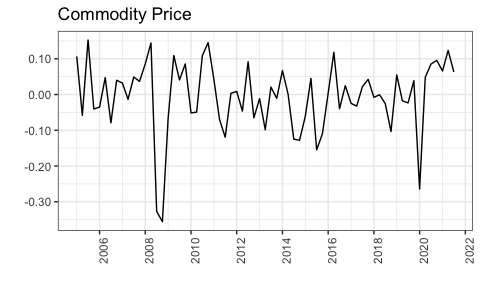
<p class="caption">
Bloomberg Commodity Price Index
</p>

</div>

``` r
p.MM.Rate <- Factors %>% mutate(date=as.Date(date)) %>% ggplot() + geom_line(aes(date, MM.Rate)) + labs(x="", y="", title="SA Money Market Rate") + theme_bw()

fmxdat::finplot(p.MM.Rate, x.vert = T, x.date.type = "%Y", x.date.dist="2 year", y.comma.sep=TRUE)
```

<div class="figure" style="text-align: left">

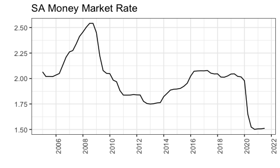
<p class="caption">
South Africa Money Market Rate
</p>

</div>

``` r
p.Real.GDP <- Factors %>% mutate(date=as.Date(date)) %>% ggplot() + geom_line(aes(date, Real.GDP)) + labs(x="", y="", title="SA Real GDP") + theme_bw()

fmxdat::finplot(p.Real.GDP, x.vert = T, x.date.type = "%Y", x.date.dist="2 year", y.comma.sep=TRUE)
```

<div class="figure" style="text-align: left">

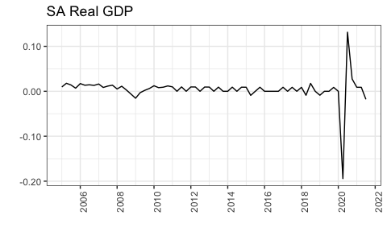
<p class="caption">
South Africa Real GDP
</p>

</div>

``` r
p.Real.Inv <- Factors %>% mutate(date=as.Date(date)) %>% ggplot() + geom_line(aes(date, Real.INV)) + labs(x="", y="", title="SA Real Investment") + theme_bw()

fmxdat::finplot(p.Real.Inv, x.vert = T, x.date.type = "%Y", x.date.dist="2 year", y.comma.sep=TRUE)
```

<div class="figure" style="text-align: left">

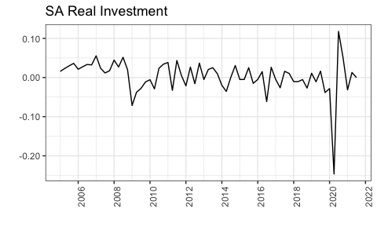
<p class="caption">
South Africa Real Gross Fixed Capital Formation
</p>

</div>

``` r
p.CPI <- Factors %>% mutate(date=as.Date(date)) %>% ggplot() + geom_line(aes(date, Inflation)) + labs(x="", y="", title="SA Inflation") + theme_bw()

fmxdat::finplot(p.CPI, x.vert = T, x.date.type = "%Y", x.date.dist="2 year", y.comma.sep=TRUE)
```

<div class="figure" style="text-align: left">

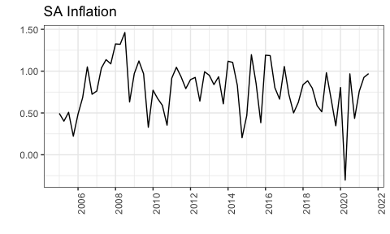
<p class="caption">
South Africa Consumer Price Inflation
</p>

</div>

``` r
p.Indus <- new_dat %>%
    filter(Tickers %in% T40) %>%
    mutate(date=as.Date(date)) %>%
    ggplot() + geom_line(aes(date, Return), color="steelblue", size=1.2, alpha=0.8) + theme_bw() + fmxdat::fmx_cols() + facet_wrap(~Superindustryname) + labs(x="Year")

fmxdat::finplot(p.Indus, x.vert = T, x.date.type = "%Y", x.date.dist="2 year", y.comma.sep=TRUE)
```

<div class="figure" style="text-align: left">


<p class="caption">
Asset Returns by Industry
</p>

</div>

# Empirical Analysis 

The model used to estimate covariance matrix parameters comprises of 8
macroeconomic factors, and 35 assets, disaggregated into their
respective super-industries. The macroeconomic factor model was then
applied to the three different industries, as these factors may affect
assets in different industries differently. These three industry classes
comprise of 10, 14, and 11 observations for the financial, industrial,
and resources sectors, respectively. This section presents the main
contribution of this paper, and the rest of it is set up as follows.
Section presents the methodology used when constructing the
macroeconomic factor model, Section presents the results from estimating
the model, and finally, Section provides a discussion of the main
results.

## Methodology 

The equation of the model is given by:

With ***F*** representing the 8 factors included in estimation,
*β*<sub>*i**k*</sub> representing the sensitivity of asset *i* to factor
*k*, (*k* = 1, ..., *K*), for industry *j* = (*F*, *I*, *R*). Factor
models rely on three main assumptions. Firstly, individual factor
realizations have zero expected value: 𝔼(*f*<sub>*k*</sub>) = 0.
Secondly, asset-specific errors are uncorrelated with each of the
factors: *c**o**v*(*f*<sub>*k**t*</sub>, *ϵ*<sub>*i**t*</sub>) = 0 ∀
*k*, *i*, & *t*. And, finally, that error terms are serially
uncorrelated: *c**o**v*(*ϵ*<sub>*i**t*</sub>, *ϵ**d**s*) = 0 ∀
*i* ≠ *d*, and *t* ≠ *s*. From this, one then essentially has that:

With the above implying that the variance of individual assets is given
by the sum of both the systematic and idiosyncratic risk components.

## Model Estimation 

This section presents the results from estimating the macroeconomic
factor model, with - displaying the estimated ***α*’s** and ***β*’s**
for each industry, where *β* represents each assets sensitivity to the
factors, and alpha the constant (excess) returns.

``` r
Factors_xts <- Factors %>% 
  tbl2xts::tbl_xts()

Financials_xts <- Financials_clean %>% tbl_xts()
Industrial_xts <- Industrial_clean %>% tbl_xts()
Resources_xts <- Resources_clean %>% tbl_xts()
```

``` r
FM_Fin <- covFactorModel::factorModel(Financials_xts, type="Macro", econ_fact = Factors_xts, rtn_Sigma = TRUE)

covmat_Fin <- FM_Fin$Sigma  # Covariance Matrix
FM_Res_Fin <- FM_Fin$residual
```

``` r
par(mfrow = c(1, 2))
barplot(FM_Fin$alpha, horiz = TRUE, 
        main = "alpha", col = "red", cex.names = 0.75, las = 1)
barplot(t(FM_Fin$beta), horiz = TRUE, 
        main = "beta", col = "blue", cex.names = 0.75, las = 1)
```

<div class="figure" style="text-align: left">

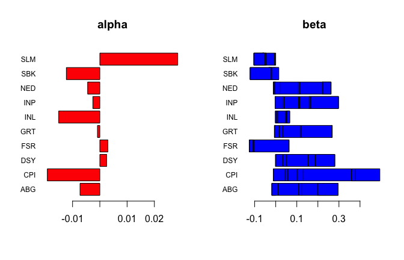
<p class="caption">
Factor Analysis: Financials
</p>

</div>

``` r
FM_Ind <- covFactorModel::factorModel(Industrial_xts, type="Macro", econ_fact = Factors_xts, rtn_Sigma = TRUE)

covmat_Ind <- FM_Ind$Sigma  # Covariance Matrix
FM_Res_Ind <- FM_Ind$residual
```

``` r
par(mfrow = c(1, 2))
barplot(FM_Ind$alpha, horiz = TRUE, 
        main = "alpha", col = "red", cex.names = 0.75, las = 1)
barplot(t(FM_Ind$beta), horiz = TRUE, 
        main = "beta", col = "blue", cex.names = 0.75, las = 1)
```

<div class="figure" style="text-align: left">

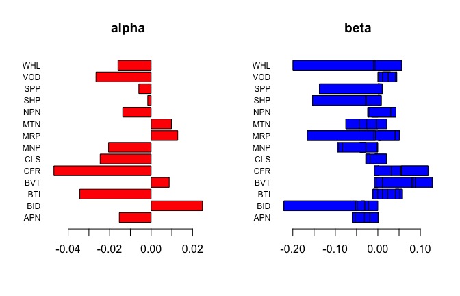
<p class="caption">
Factor Analysis: Industrial
</p>

</div>

``` r
FM_Res <- covFactorModel::factorModel(Resources_xts, type="Macro", econ_fact = Factors_xts, rtn_Sigma = TRUE)

covmat_Res <- FM_Res$Sigma  # Covariance Matrix
FM_Res_Res <- FM_Res$residual
```

``` r
par(mfrow = c(1, 2))
barplot(FM_Res$alpha, horiz = TRUE, 
        main = "alpha", col = "red", cex.names = 0.75, las = 1)
barplot(t(FM_Res$beta), horiz = TRUE, 
        main = "beta", col = "blue", cex.names = 0.75, las = 1)
```

<div class="figure" style="text-align: left">

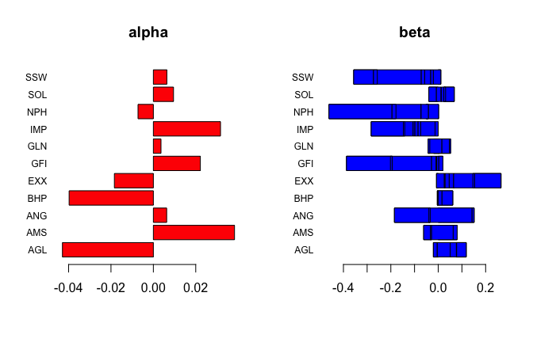
<p class="caption">
Factor Analysis: Resources
</p>

</div>

## Discussion of Results 

Figure displays the output from the factor analysis for stocks in the
financial sector. From this, one can see that these assets tend to have
a greater (positive) sensitivity to the macroeconomic factors, whilst
Sanlam (SLM) appears to generate the greatest excess return. Similarly,
Figure displays these results for the industrial sector, and Figure for
resources. In addition to this, Tables 7.3, 7.6, and 7.9 in the appendix
present that estimated covariance matrices for each of the assets in
each industry. From these, one can see that there are many assets which
exhibit zero covariance relative to the others, implying that after
controlling for the common macroeconomic factors, the variance between
many of the asset returns is null.

# Conclusion 

This paper attempted to investigate the relationship between South
African assets in different industries and a series of macroeconomic
factors. To this end, 35 securities, from the financial, industrial, and
resources sectors, were considered, along with eight macroeconomic
factors. The sensitivities (loadings) of each asset to the macroeconomic
factors were presented in Section , as well as the covariance matrices
for each industry. Whilst the aim of this study was to consider
macroeconomic factors in estimating the covariance matrix, future
investigations could use regression analysis to supplement the study.
Such as @Flannery, who use a GARCH to model the impact of macroeconomic
conditions on asset returns, or as in @Maio2015 who use dynamic factor
analysis for identifying macroeconomic factors, and a VAR to decompose
asset returns.

# References

<div id="refs">

</div>

# Appendix: Supplementary Tables

## Financial

``` r
FM_Fin$beta %>% kable(caption="Factor Beta's: Financial", align="l", digits = 4) %>% kable_styling(latex_options = "HOLD_position")
```

<table class="table" style="margin-left: auto; margin-right: auto;">
<caption>
Factor Beta’s: Financial
</caption>
<thead>
<tr>
<th style="text-align:left;">
</th>
<th style="text-align:left;">
US_10Yr
</th>
<th style="text-align:left;">
Bcom_Index
</th>
<th style="text-align:left;">
VIX
</th>
<th style="text-align:left;">
USDZAR
</th>
<th style="text-align:left;">
MM.Rate
</th>
<th style="text-align:left;">
Real.GDP
</th>
<th style="text-align:left;">
Real.INV
</th>
<th style="text-align:left;">
Inflation
</th>
</tr>
</thead>
<tbody>
<tr>
<td style="text-align:left;">
ABG
</td>
<td style="text-align:left;">
-0.0133
</td>
<td style="text-align:left;">
-0.0056
</td>
<td style="text-align:left;">
0.0306
</td>
<td style="text-align:left;">
0.0976
</td>
<td style="text-align:left;">
0.0133
</td>
<td style="text-align:left;">
0.1730
</td>
<td style="text-align:left;">
-0.0981
</td>
<td style="text-align:left;">
0.0000
</td>
</tr>
<tr>
<td style="text-align:left;">
CPI
</td>
<td style="text-align:left;">
-0.0113
</td>
<td style="text-align:left;">
0.0554
</td>
<td style="text-align:left;">
0.0137
</td>
<td style="text-align:left;">
0.0435
</td>
<td style="text-align:left;">
0.0275
</td>
<td style="text-align:left;">
0.3649
</td>
<td style="text-align:left;">
-0.1153
</td>
<td style="text-align:left;">
-0.0192
</td>
</tr>
<tr>
<td style="text-align:left;">
DSY
</td>
<td style="text-align:left;">
-0.0011
</td>
<td style="text-align:left;">
0.0344
</td>
<td style="text-align:left;">
0.0168
</td>
<td style="text-align:left;">
0.1036
</td>
<td style="text-align:left;">
0.0003
</td>
<td style="text-align:left;">
0.1265
</td>
<td style="text-align:left;">
-0.0930
</td>
<td style="text-align:left;">
-0.0001
</td>
</tr>
<tr>
<td style="text-align:left;">
FSR
</td>
<td style="text-align:left;">
-0.0084
</td>
<td style="text-align:left;">
0.0091
</td>
<td style="text-align:left;">
0.0097
</td>
<td style="text-align:left;">
0.0494
</td>
<td style="text-align:left;">
0.0034
</td>
<td style="text-align:left;">
-0.1884
</td>
<td style="text-align:left;">
0.0182
</td>
<td style="text-align:left;">
0.0034
</td>
</tr>
<tr>
<td style="text-align:left;">
GRT
</td>
<td style="text-align:left;">
-0.0063
</td>
<td style="text-align:left;">
0.0230
</td>
<td style="text-align:left;">
0.0164
</td>
<td style="text-align:left;">
0.0834
</td>
<td style="text-align:left;">
0.0047
</td>
<td style="text-align:left;">
0.1469
</td>
<td style="text-align:left;">
-0.0032
</td>
<td style="text-align:left;">
0.0006
</td>
</tr>
<tr>
<td style="text-align:left;">
INL
</td>
<td style="text-align:left;">
-0.0017
</td>
<td style="text-align:left;">
0.0076
</td>
<td style="text-align:left;">
0.0077
</td>
<td style="text-align:left;">
0.0339
</td>
<td style="text-align:left;">
0.0088
</td>
<td style="text-align:left;">
0.0102
</td>
<td style="text-align:left;">
-0.0150
</td>
<td style="text-align:left;">
0.0013
</td>
</tr>
<tr>
<td style="text-align:left;">
INP
</td>
<td style="text-align:left;">
-0.0026
</td>
<td style="text-align:left;">
0.0340
</td>
<td style="text-align:left;">
0.0083
</td>
<td style="text-align:left;">
0.0686
</td>
<td style="text-align:left;">
0.0051
</td>
<td style="text-align:left;">
0.1847
</td>
<td style="text-align:left;">
-0.1322
</td>
<td style="text-align:left;">
-0.0077
</td>
</tr>
<tr>
<td style="text-align:left;">
NED
</td>
<td style="text-align:left;">
-0.0117
</td>
<td style="text-align:left;">
0.0071
</td>
<td style="text-align:left;">
0.0245
</td>
<td style="text-align:left;">
0.0863
</td>
<td style="text-align:left;">
0.0086
</td>
<td style="text-align:left;">
0.1478
</td>
<td style="text-align:left;">
-0.0415
</td>
<td style="text-align:left;">
0.0035
</td>
</tr>
<tr>
<td style="text-align:left;">
SBK
</td>
<td style="text-align:left;">
-0.0022
</td>
<td style="text-align:left;">
-0.0311
</td>
<td style="text-align:left;">
0.0093
</td>
<td style="text-align:left;">
0.0319
</td>
<td style="text-align:left;">
0.0065
</td>
<td style="text-align:left;">
-0.1362
</td>
<td style="text-align:left;">
0.1003
</td>
<td style="text-align:left;">
0.0023
</td>
</tr>
<tr>
<td style="text-align:left;">
SLM
</td>
<td style="text-align:left;">
-0.0061
</td>
<td style="text-align:left;">
-0.0567
</td>
<td style="text-align:left;">
0.0035
</td>
<td style="text-align:left;">
0.0030
</td>
<td style="text-align:left;">
-0.0116
</td>
<td style="text-align:left;">
-0.0363
</td>
<td style="text-align:left;">
0.0530
</td>
<td style="text-align:left;">
0.0059
</td>
</tr>
</tbody>
</table>

``` r
FM_Fin$alpha %>% kable(caption="Factor Alpha's: Financial", align="l", digits = 4) %>% kable_styling(latex_options = "HOLD_position")
```

<table class="table" style="margin-left: auto; margin-right: auto;">
<caption>
Factor Alpha’s: Financial
</caption>
<thead>
<tr>
<th style="text-align:left;">
</th>
<th style="text-align:left;">
x
</th>
</tr>
</thead>
<tbody>
<tr>
<td style="text-align:left;">
ABG
</td>
<td style="text-align:left;">
-0.0073
</td>
</tr>
<tr>
<td style="text-align:left;">
CPI
</td>
<td style="text-align:left;">
-0.0193
</td>
</tr>
<tr>
<td style="text-align:left;">
DSY
</td>
<td style="text-align:left;">
0.0025
</td>
</tr>
<tr>
<td style="text-align:left;">
FSR
</td>
<td style="text-align:left;">
0.0029
</td>
</tr>
<tr>
<td style="text-align:left;">
GRT
</td>
<td style="text-align:left;">
-0.0009
</td>
</tr>
<tr>
<td style="text-align:left;">
INL
</td>
<td style="text-align:left;">
-0.0151
</td>
</tr>
<tr>
<td style="text-align:left;">
INP
</td>
<td style="text-align:left;">
-0.0026
</td>
</tr>
<tr>
<td style="text-align:left;">
NED
</td>
<td style="text-align:left;">
-0.0045
</td>
</tr>
<tr>
<td style="text-align:left;">
SBK
</td>
<td style="text-align:left;">
-0.0123
</td>
</tr>
<tr>
<td style="text-align:left;">
SLM
</td>
<td style="text-align:left;">
0.0286
</td>
</tr>
</tbody>
</table>

``` r
covmat_Fin %>% kable(caption="Covariance Matrix: Financial", align="l", digits = 4) %>% kable_styling(latex_options = "HOLD_position")
```

<table class="table" style="margin-left: auto; margin-right: auto;">
<caption>
Covariance Matrix: Financial
</caption>
<thead>
<tr>
<th style="text-align:left;">
</th>
<th style="text-align:left;">
ABG
</th>
<th style="text-align:left;">
CPI
</th>
<th style="text-align:left;">
DSY
</th>
<th style="text-align:left;">
FSR
</th>
<th style="text-align:left;">
GRT
</th>
<th style="text-align:left;">
INL
</th>
<th style="text-align:left;">
INP
</th>
<th style="text-align:left;">
NED
</th>
<th style="text-align:left;">
SBK
</th>
<th style="text-align:left;">
SLM
</th>
</tr>
</thead>
<tbody>
<tr>
<td style="text-align:left;">
ABG
</td>
<td style="text-align:left;">
9e-04
</td>
<td style="text-align:left;">
1e-04
</td>
<td style="text-align:left;">
1e-04
</td>
<td style="text-align:left;">
1e-04
</td>
<td style="text-align:left;">
1e-04
</td>
<td style="text-align:left;">
1e-04
</td>
<td style="text-align:left;">
1e-04
</td>
<td style="text-align:left;">
2e-04
</td>
<td style="text-align:left;">
1e-04
</td>
<td style="text-align:left;">
1e-04
</td>
</tr>
<tr>
<td style="text-align:left;">
CPI
</td>
<td style="text-align:left;">
1e-04
</td>
<td style="text-align:left;">
5e-04
</td>
<td style="text-align:left;">
0e+00
</td>
<td style="text-align:left;">
0e+00
</td>
<td style="text-align:left;">
1e-04
</td>
<td style="text-align:left;">
0e+00
</td>
<td style="text-align:left;">
0e+00
</td>
<td style="text-align:left;">
1e-04
</td>
<td style="text-align:left;">
0e+00
</td>
<td style="text-align:left;">
0e+00
</td>
</tr>
<tr>
<td style="text-align:left;">
DSY
</td>
<td style="text-align:left;">
1e-04
</td>
<td style="text-align:left;">
0e+00
</td>
<td style="text-align:left;">
4e-04
</td>
<td style="text-align:left;">
0e+00
</td>
<td style="text-align:left;">
1e-04
</td>
<td style="text-align:left;">
0e+00
</td>
<td style="text-align:left;">
0e+00
</td>
<td style="text-align:left;">
1e-04
</td>
<td style="text-align:left;">
0e+00
</td>
<td style="text-align:left;">
0e+00
</td>
</tr>
<tr>
<td style="text-align:left;">
FSR
</td>
<td style="text-align:left;">
1e-04
</td>
<td style="text-align:left;">
0e+00
</td>
<td style="text-align:left;">
0e+00
</td>
<td style="text-align:left;">
5e-04
</td>
<td style="text-align:left;">
0e+00
</td>
<td style="text-align:left;">
0e+00
</td>
<td style="text-align:left;">
0e+00
</td>
<td style="text-align:left;">
1e-04
</td>
<td style="text-align:left;">
0e+00
</td>
<td style="text-align:left;">
0e+00
</td>
</tr>
<tr>
<td style="text-align:left;">
GRT
</td>
<td style="text-align:left;">
1e-04
</td>
<td style="text-align:left;">
1e-04
</td>
<td style="text-align:left;">
1e-04
</td>
<td style="text-align:left;">
0e+00
</td>
<td style="text-align:left;">
4e-04
</td>
<td style="text-align:left;">
0e+00
</td>
<td style="text-align:left;">
0e+00
</td>
<td style="text-align:left;">
1e-04
</td>
<td style="text-align:left;">
1e-04
</td>
<td style="text-align:left;">
0e+00
</td>
</tr>
<tr>
<td style="text-align:left;">
INL
</td>
<td style="text-align:left;">
1e-04
</td>
<td style="text-align:left;">
0e+00
</td>
<td style="text-align:left;">
0e+00
</td>
<td style="text-align:left;">
0e+00
</td>
<td style="text-align:left;">
0e+00
</td>
<td style="text-align:left;">
3e-04
</td>
<td style="text-align:left;">
0e+00
</td>
<td style="text-align:left;">
1e-04
</td>
<td style="text-align:left;">
0e+00
</td>
<td style="text-align:left;">
0e+00
</td>
</tr>
<tr>
<td style="text-align:left;">
INP
</td>
<td style="text-align:left;">
1e-04
</td>
<td style="text-align:left;">
0e+00
</td>
<td style="text-align:left;">
0e+00
</td>
<td style="text-align:left;">
0e+00
</td>
<td style="text-align:left;">
0e+00
</td>
<td style="text-align:left;">
0e+00
</td>
<td style="text-align:left;">
4e-04
</td>
<td style="text-align:left;">
0e+00
</td>
<td style="text-align:left;">
0e+00
</td>
<td style="text-align:left;">
0e+00
</td>
</tr>
<tr>
<td style="text-align:left;">
NED
</td>
<td style="text-align:left;">
2e-04
</td>
<td style="text-align:left;">
1e-04
</td>
<td style="text-align:left;">
1e-04
</td>
<td style="text-align:left;">
1e-04
</td>
<td style="text-align:left;">
1e-04
</td>
<td style="text-align:left;">
1e-04
</td>
<td style="text-align:left;">
0e+00
</td>
<td style="text-align:left;">
6e-04
</td>
<td style="text-align:left;">
1e-04
</td>
<td style="text-align:left;">
1e-04
</td>
</tr>
<tr>
<td style="text-align:left;">
SBK
</td>
<td style="text-align:left;">
1e-04
</td>
<td style="text-align:left;">
0e+00
</td>
<td style="text-align:left;">
0e+00
</td>
<td style="text-align:left;">
0e+00
</td>
<td style="text-align:left;">
1e-04
</td>
<td style="text-align:left;">
0e+00
</td>
<td style="text-align:left;">
0e+00
</td>
<td style="text-align:left;">
1e-04
</td>
<td style="text-align:left;">
6e-04
</td>
<td style="text-align:left;">
0e+00
</td>
</tr>
<tr>
<td style="text-align:left;">
SLM
</td>
<td style="text-align:left;">
1e-04
</td>
<td style="text-align:left;">
0e+00
</td>
<td style="text-align:left;">
0e+00
</td>
<td style="text-align:left;">
0e+00
</td>
<td style="text-align:left;">
0e+00
</td>
<td style="text-align:left;">
0e+00
</td>
<td style="text-align:left;">
0e+00
</td>
<td style="text-align:left;">
1e-04
</td>
<td style="text-align:left;">
0e+00
</td>
<td style="text-align:left;">
4e-04
</td>
</tr>
</tbody>
</table>
## Industrial

``` r
FM_Ind$beta  %>% kable(caption="Factor Beta's: Industrial", align="l", digits = 4) %>% kable_styling(latex_options = "HOLD_position")
```

<table class="table" style="margin-left: auto; margin-right: auto;">
<caption>
Factor Beta’s: Industrial
</caption>
<thead>
<tr>
<th style="text-align:left;">
</th>
<th style="text-align:left;">
US_10Yr
</th>
<th style="text-align:left;">
Bcom_Index
</th>
<th style="text-align:left;">
VIX
</th>
<th style="text-align:left;">
USDZAR
</th>
<th style="text-align:left;">
MM.Rate
</th>
<th style="text-align:left;">
Real.GDP
</th>
<th style="text-align:left;">
Real.INV
</th>
<th style="text-align:left;">
Inflation
</th>
</tr>
</thead>
<tbody>
<tr>
<td style="text-align:left;">
APN
</td>
<td style="text-align:left;">
0.0005
</td>
<td style="text-align:left;">
-0.0506
</td>
<td style="text-align:left;">
0.0028
</td>
<td style="text-align:left;">
0.0265
</td>
<td style="text-align:left;">
0.0018
</td>
<td style="text-align:left;">
-0.0411
</td>
<td style="text-align:left;">
0.0063
</td>
<td style="text-align:left;">
0.0220
</td>
</tr>
<tr>
<td style="text-align:left;">
BID
</td>
<td style="text-align:left;">
0.0026
</td>
<td style="text-align:left;">
0.0544
</td>
<td style="text-align:left;">
0.0079
</td>
<td style="text-align:left;">
0.0817
</td>
<td style="text-align:left;">
0.0051
</td>
<td style="text-align:left;">
0.0147
</td>
<td style="text-align:left;">
0.0092
</td>
<td style="text-align:left;">
0.0040
</td>
</tr>
<tr>
<td style="text-align:left;">
BTI
</td>
<td style="text-align:left;">
-0.0091
</td>
<td style="text-align:left;">
0.0024
</td>
<td style="text-align:left;">
0.0071
</td>
<td style="text-align:left;">
0.0452
</td>
<td style="text-align:left;">
0.0213
</td>
<td style="text-align:left;">
0.0587
</td>
<td style="text-align:left;">
-0.0265
</td>
<td style="text-align:left;">
-0.0105
</td>
</tr>
<tr>
<td style="text-align:left;">
BVT
</td>
<td style="text-align:left;">
-0.0087
</td>
<td style="text-align:left;">
0.0050
</td>
<td style="text-align:left;">
0.0150
</td>
<td style="text-align:left;">
0.0690
</td>
<td style="text-align:left;">
0.0030
</td>
<td style="text-align:left;">
0.0046
</td>
<td style="text-align:left;">
0.0404
</td>
<td style="text-align:left;">
0.0001
</td>
</tr>
<tr>
<td style="text-align:left;">
CFR
</td>
<td style="text-align:left;">
0.0029
</td>
<td style="text-align:left;">
-0.0017
</td>
<td style="text-align:left;">
-0.0094
</td>
<td style="text-align:left;">
0.0403
</td>
<td style="text-align:left;">
0.0212
</td>
<td style="text-align:left;">
0.0651
</td>
<td style="text-align:left;">
-0.0622
</td>
<td style="text-align:left;">
-0.0011
</td>
</tr>
<tr>
<td style="text-align:left;">
CLS
</td>
<td style="text-align:left;">
-0.0029
</td>
<td style="text-align:left;">
-0.0040
</td>
<td style="text-align:left;">
0.0004
</td>
<td style="text-align:left;">
0.0153
</td>
<td style="text-align:left;">
0.0116
</td>
<td style="text-align:left;">
-0.0488
</td>
<td style="text-align:left;">
0.0009
</td>
<td style="text-align:left;">
0.0089
</td>
</tr>
<tr>
<td style="text-align:left;">
MNP
</td>
<td style="text-align:left;">
-0.0017
</td>
<td style="text-align:left;">
-0.0269
</td>
<td style="text-align:left;">
0.0074
</td>
<td style="text-align:left;">
0.0035
</td>
<td style="text-align:left;">
0.0145
</td>
<td style="text-align:left;">
-0.0753
</td>
<td style="text-align:left;">
-0.0151
</td>
<td style="text-align:left;">
0.0041
</td>
</tr>
<tr>
<td style="text-align:left;">
MRP
</td>
<td style="text-align:left;">
0.0069
</td>
<td style="text-align:left;">
-0.0046
</td>
<td style="text-align:left;">
0.0045
</td>
<td style="text-align:left;">
0.0441
</td>
<td style="text-align:left;">
-0.0104
</td>
<td style="text-align:left;">
-0.2065
</td>
<td style="text-align:left;">
0.1566
</td>
<td style="text-align:left;">
0.0037
</td>
</tr>
<tr>
<td style="text-align:left;">
MTN
</td>
<td style="text-align:left;">
-0.0051
</td>
<td style="text-align:left;">
-0.0701
</td>
<td style="text-align:left;">
0.0312
</td>
<td style="text-align:left;">
0.0190
</td>
<td style="text-align:left;">
-0.0010
</td>
<td style="text-align:left;">
0.0230
</td>
<td style="text-align:left;">
0.0244
</td>
<td style="text-align:left;">
0.0001
</td>
</tr>
<tr>
<td style="text-align:left;">
NPN
</td>
<td style="text-align:left;">
0.0005
</td>
<td style="text-align:left;">
-0.0068
</td>
<td style="text-align:left;">
-0.0086
</td>
<td style="text-align:left;">
0.0493
</td>
<td style="text-align:left;">
0.0081
</td>
<td style="text-align:left;">
-0.0125
</td>
<td style="text-align:left;">
-0.0537
</td>
<td style="text-align:left;">
0.0027
</td>
</tr>
<tr>
<td style="text-align:left;">
SHP
</td>
<td style="text-align:left;">
0.0026
</td>
<td style="text-align:left;">
-0.0013
</td>
<td style="text-align:left;">
0.0016
</td>
<td style="text-align:left;">
0.0038
</td>
<td style="text-align:left;">
0.0013
</td>
<td style="text-align:left;">
-0.1616
</td>
<td style="text-align:left;">
0.1257
</td>
<td style="text-align:left;">
-0.0009
</td>
</tr>
<tr>
<td style="text-align:left;">
SPP
</td>
<td style="text-align:left;">
0.0048
</td>
<td style="text-align:left;">
-0.0038
</td>
<td style="text-align:left;">
0.0081
</td>
<td style="text-align:left;">
-0.0091
</td>
<td style="text-align:left;">
0.0023
</td>
<td style="text-align:left;">
-0.1399
</td>
<td style="text-align:left;">
0.1479
</td>
<td style="text-align:left;">
0.0016
</td>
</tr>
<tr>
<td style="text-align:left;">
VOD
</td>
<td style="text-align:left;">
0.0052
</td>
<td style="text-align:left;">
-0.0131
</td>
<td style="text-align:left;">
0.0098
</td>
<td style="text-align:left;">
-0.0441
</td>
<td style="text-align:left;">
0.0014
</td>
<td style="text-align:left;">
-0.0985
</td>
<td style="text-align:left;">
0.1094
</td>
<td style="text-align:left;">
-0.0045
</td>
</tr>
<tr>
<td style="text-align:left;">
WHL
</td>
<td style="text-align:left;">
0.0082
</td>
<td style="text-align:left;">
0.0223
</td>
<td style="text-align:left;">
0.0030
</td>
<td style="text-align:left;">
0.0183
</td>
<td style="text-align:left;">
0.0042
</td>
<td style="text-align:left;">
-0.2556
</td>
<td style="text-align:left;">
0.1899
</td>
<td style="text-align:left;">
0.0032
</td>
</tr>
</tbody>
</table>

``` r
FM_Ind$alpha %>% kable(caption="Factor Alpha's: Industrial", align="l", digits = 4) %>% kable_styling(latex_options = "HOLD_position")
```

<table class="table" style="margin-left: auto; margin-right: auto;">
<caption>
Factor Alpha’s: Industrial
</caption>
<thead>
<tr>
<th style="text-align:left;">
</th>
<th style="text-align:left;">
x
</th>
</tr>
</thead>
<tbody>
<tr>
<td style="text-align:left;">
APN
</td>
<td style="text-align:left;">
-0.0154
</td>
</tr>
<tr>
<td style="text-align:left;">
BID
</td>
<td style="text-align:left;">
-0.0145
</td>
</tr>
<tr>
<td style="text-align:left;">
BTI
</td>
<td style="text-align:left;">
-0.0232
</td>
</tr>
<tr>
<td style="text-align:left;">
BVT
</td>
<td style="text-align:left;">
0.0087
</td>
</tr>
<tr>
<td style="text-align:left;">
CFR
</td>
<td style="text-align:left;">
-0.0469
</td>
</tr>
<tr>
<td style="text-align:left;">
CLS
</td>
<td style="text-align:left;">
-0.0246
</td>
</tr>
<tr>
<td style="text-align:left;">
MNP
</td>
<td style="text-align:left;">
-0.0270
</td>
</tr>
<tr>
<td style="text-align:left;">
MRP
</td>
<td style="text-align:left;">
0.0128
</td>
</tr>
<tr>
<td style="text-align:left;">
MTN
</td>
<td style="text-align:left;">
0.0098
</td>
</tr>
<tr>
<td style="text-align:left;">
NPN
</td>
<td style="text-align:left;">
-0.0137
</td>
</tr>
<tr>
<td style="text-align:left;">
SHP
</td>
<td style="text-align:left;">
-0.0016
</td>
</tr>
<tr>
<td style="text-align:left;">
SPP
</td>
<td style="text-align:left;">
-0.0059
</td>
</tr>
<tr>
<td style="text-align:left;">
VOD
</td>
<td style="text-align:left;">
-0.0045
</td>
</tr>
<tr>
<td style="text-align:left;">
WHL
</td>
<td style="text-align:left;">
-0.0160
</td>
</tr>
</tbody>
</table>

``` r
covmat_Ind %>% kable(caption="Covariance Matrix: Industrial", align="l", digits = 4) %>%  kable_styling(latex_options = "HOLD_position")
```

<table class="table" style="margin-left: auto; margin-right: auto;">
<caption>
Covariance Matrix: Industrial
</caption>
<thead>
<tr>
<th style="text-align:left;">
</th>
<th style="text-align:left;">
APN
</th>
<th style="text-align:left;">
BID
</th>
<th style="text-align:left;">
BTI
</th>
<th style="text-align:left;">
BVT
</th>
<th style="text-align:left;">
CFR
</th>
<th style="text-align:left;">
CLS
</th>
<th style="text-align:left;">
MNP
</th>
<th style="text-align:left;">
MRP
</th>
<th style="text-align:left;">
MTN
</th>
<th style="text-align:left;">
NPN
</th>
<th style="text-align:left;">
SHP
</th>
<th style="text-align:left;">
SPP
</th>
<th style="text-align:left;">
VOD
</th>
<th style="text-align:left;">
WHL
</th>
</tr>
</thead>
<tbody>
<tr>
<td style="text-align:left;">
APN
</td>
<td style="text-align:left;">
5e-04
</td>
<td style="text-align:left;">
0e+00
</td>
<td style="text-align:left;">
0e+00
</td>
<td style="text-align:left;">
1e-04
</td>
<td style="text-align:left;">
0e+00
</td>
<td style="text-align:left;">
0e+00
</td>
<td style="text-align:left;">
1e-04
</td>
<td style="text-align:left;">
0e+00
</td>
<td style="text-align:left;">
0.0001
</td>
<td style="text-align:left;">
0e+00
</td>
<td style="text-align:left;">
0e+00
</td>
<td style="text-align:left;">
0e+00
</td>
<td style="text-align:left;">
0e+00
</td>
<td style="text-align:left;">
0e+00
</td>
</tr>
<tr>
<td style="text-align:left;">
BID
</td>
<td style="text-align:left;">
0e+00
</td>
<td style="text-align:left;">
5e-04
</td>
<td style="text-align:left;">
0e+00
</td>
<td style="text-align:left;">
0e+00
</td>
<td style="text-align:left;">
0e+00
</td>
<td style="text-align:left;">
0e+00
</td>
<td style="text-align:left;">
0e+00
</td>
<td style="text-align:left;">
0e+00
</td>
<td style="text-align:left;">
0.0000
</td>
<td style="text-align:left;">
0e+00
</td>
<td style="text-align:left;">
0e+00
</td>
<td style="text-align:left;">
0e+00
</td>
<td style="text-align:left;">
0e+00
</td>
<td style="text-align:left;">
0e+00
</td>
</tr>
<tr>
<td style="text-align:left;">
BTI
</td>
<td style="text-align:left;">
0e+00
</td>
<td style="text-align:left;">
0e+00
</td>
<td style="text-align:left;">
2e-04
</td>
<td style="text-align:left;">
0e+00
</td>
<td style="text-align:left;">
0e+00
</td>
<td style="text-align:left;">
0e+00
</td>
<td style="text-align:left;">
0e+00
</td>
<td style="text-align:left;">
0e+00
</td>
<td style="text-align:left;">
0.0001
</td>
<td style="text-align:left;">
0e+00
</td>
<td style="text-align:left;">
0e+00
</td>
<td style="text-align:left;">
0e+00
</td>
<td style="text-align:left;">
0e+00
</td>
<td style="text-align:left;">
0e+00
</td>
</tr>
<tr>
<td style="text-align:left;">
BVT
</td>
<td style="text-align:left;">
1e-04
</td>
<td style="text-align:left;">
0e+00
</td>
<td style="text-align:left;">
0e+00
</td>
<td style="text-align:left;">
4e-04
</td>
<td style="text-align:left;">
0e+00
</td>
<td style="text-align:left;">
0e+00
</td>
<td style="text-align:left;">
0e+00
</td>
<td style="text-align:left;">
0e+00
</td>
<td style="text-align:left;">
0.0001
</td>
<td style="text-align:left;">
0e+00
</td>
<td style="text-align:left;">
0e+00
</td>
<td style="text-align:left;">
0e+00
</td>
<td style="text-align:left;">
0e+00
</td>
<td style="text-align:left;">
0e+00
</td>
</tr>
<tr>
<td style="text-align:left;">
CFR
</td>
<td style="text-align:left;">
0e+00
</td>
<td style="text-align:left;">
0e+00
</td>
<td style="text-align:left;">
0e+00
</td>
<td style="text-align:left;">
0e+00
</td>
<td style="text-align:left;">
3e-04
</td>
<td style="text-align:left;">
0e+00
</td>
<td style="text-align:left;">
0e+00
</td>
<td style="text-align:left;">
0e+00
</td>
<td style="text-align:left;">
0.0000
</td>
<td style="text-align:left;">
0e+00
</td>
<td style="text-align:left;">
0e+00
</td>
<td style="text-align:left;">
0e+00
</td>
<td style="text-align:left;">
0e+00
</td>
<td style="text-align:left;">
0e+00
</td>
</tr>
<tr>
<td style="text-align:left;">
CLS
</td>
<td style="text-align:left;">
0e+00
</td>
<td style="text-align:left;">
0e+00
</td>
<td style="text-align:left;">
0e+00
</td>
<td style="text-align:left;">
0e+00
</td>
<td style="text-align:left;">
0e+00
</td>
<td style="text-align:left;">
5e-04
</td>
<td style="text-align:left;">
0e+00
</td>
<td style="text-align:left;">
0e+00
</td>
<td style="text-align:left;">
0.0000
</td>
<td style="text-align:left;">
0e+00
</td>
<td style="text-align:left;">
0e+00
</td>
<td style="text-align:left;">
0e+00
</td>
<td style="text-align:left;">
0e+00
</td>
<td style="text-align:left;">
0e+00
</td>
</tr>
<tr>
<td style="text-align:left;">
MNP
</td>
<td style="text-align:left;">
1e-04
</td>
<td style="text-align:left;">
0e+00
</td>
<td style="text-align:left;">
0e+00
</td>
<td style="text-align:left;">
0e+00
</td>
<td style="text-align:left;">
0e+00
</td>
<td style="text-align:left;">
0e+00
</td>
<td style="text-align:left;">
2e-04
</td>
<td style="text-align:left;">
0e+00
</td>
<td style="text-align:left;">
0.0001
</td>
<td style="text-align:left;">
0e+00
</td>
<td style="text-align:left;">
0e+00
</td>
<td style="text-align:left;">
0e+00
</td>
<td style="text-align:left;">
0e+00
</td>
<td style="text-align:left;">
0e+00
</td>
</tr>
<tr>
<td style="text-align:left;">
MRP
</td>
<td style="text-align:left;">
0e+00
</td>
<td style="text-align:left;">
0e+00
</td>
<td style="text-align:left;">
0e+00
</td>
<td style="text-align:left;">
0e+00
</td>
<td style="text-align:left;">
0e+00
</td>
<td style="text-align:left;">
0e+00
</td>
<td style="text-align:left;">
0e+00
</td>
<td style="text-align:left;">
4e-04
</td>
<td style="text-align:left;">
0.0001
</td>
<td style="text-align:left;">
0e+00
</td>
<td style="text-align:left;">
0e+00
</td>
<td style="text-align:left;">
0e+00
</td>
<td style="text-align:left;">
0e+00
</td>
<td style="text-align:left;">
0e+00
</td>
</tr>
<tr>
<td style="text-align:left;">
MTN
</td>
<td style="text-align:left;">
1e-04
</td>
<td style="text-align:left;">
0e+00
</td>
<td style="text-align:left;">
1e-04
</td>
<td style="text-align:left;">
1e-04
</td>
<td style="text-align:left;">
0e+00
</td>
<td style="text-align:left;">
0e+00
</td>
<td style="text-align:left;">
1e-04
</td>
<td style="text-align:left;">
1e-04
</td>
<td style="text-align:left;">
0.0011
</td>
<td style="text-align:left;">
0e+00
</td>
<td style="text-align:left;">
0e+00
</td>
<td style="text-align:left;">
0e+00
</td>
<td style="text-align:left;">
0e+00
</td>
<td style="text-align:left;">
0e+00
</td>
</tr>
<tr>
<td style="text-align:left;">
NPN
</td>
<td style="text-align:left;">
0e+00
</td>
<td style="text-align:left;">
0e+00
</td>
<td style="text-align:left;">
0e+00
</td>
<td style="text-align:left;">
0e+00
</td>
<td style="text-align:left;">
0e+00
</td>
<td style="text-align:left;">
0e+00
</td>
<td style="text-align:left;">
0e+00
</td>
<td style="text-align:left;">
0e+00
</td>
<td style="text-align:left;">
0.0000
</td>
<td style="text-align:left;">
4e-04
</td>
<td style="text-align:left;">
0e+00
</td>
<td style="text-align:left;">
0e+00
</td>
<td style="text-align:left;">
0e+00
</td>
<td style="text-align:left;">
0e+00
</td>
</tr>
<tr>
<td style="text-align:left;">
SHP
</td>
<td style="text-align:left;">
0e+00
</td>
<td style="text-align:left;">
0e+00
</td>
<td style="text-align:left;">
0e+00
</td>
<td style="text-align:left;">
0e+00
</td>
<td style="text-align:left;">
0e+00
</td>
<td style="text-align:left;">
0e+00
</td>
<td style="text-align:left;">
0e+00
</td>
<td style="text-align:left;">
0e+00
</td>
<td style="text-align:left;">
0.0000
</td>
<td style="text-align:left;">
0e+00
</td>
<td style="text-align:left;">
3e-04
</td>
<td style="text-align:left;">
0e+00
</td>
<td style="text-align:left;">
0e+00
</td>
<td style="text-align:left;">
0e+00
</td>
</tr>
<tr>
<td style="text-align:left;">
SPP
</td>
<td style="text-align:left;">
0e+00
</td>
<td style="text-align:left;">
0e+00
</td>
<td style="text-align:left;">
0e+00
</td>
<td style="text-align:left;">
0e+00
</td>
<td style="text-align:left;">
0e+00
</td>
<td style="text-align:left;">
0e+00
</td>
<td style="text-align:left;">
0e+00
</td>
<td style="text-align:left;">
0e+00
</td>
<td style="text-align:left;">
0.0000
</td>
<td style="text-align:left;">
0e+00
</td>
<td style="text-align:left;">
0e+00
</td>
<td style="text-align:left;">
2e-04
</td>
<td style="text-align:left;">
0e+00
</td>
<td style="text-align:left;">
0e+00
</td>
</tr>
<tr>
<td style="text-align:left;">
VOD
</td>
<td style="text-align:left;">
0e+00
</td>
<td style="text-align:left;">
0e+00
</td>
<td style="text-align:left;">
0e+00
</td>
<td style="text-align:left;">
0e+00
</td>
<td style="text-align:left;">
0e+00
</td>
<td style="text-align:left;">
0e+00
</td>
<td style="text-align:left;">
0e+00
</td>
<td style="text-align:left;">
0e+00
</td>
<td style="text-align:left;">
0.0000
</td>
<td style="text-align:left;">
0e+00
</td>
<td style="text-align:left;">
0e+00
</td>
<td style="text-align:left;">
0e+00
</td>
<td style="text-align:left;">
3e-04
</td>
<td style="text-align:left;">
0e+00
</td>
</tr>
<tr>
<td style="text-align:left;">
WHL
</td>
<td style="text-align:left;">
0e+00
</td>
<td style="text-align:left;">
0e+00
</td>
<td style="text-align:left;">
0e+00
</td>
<td style="text-align:left;">
0e+00
</td>
<td style="text-align:left;">
0e+00
</td>
<td style="text-align:left;">
0e+00
</td>
<td style="text-align:left;">
0e+00
</td>
<td style="text-align:left;">
0e+00
</td>
<td style="text-align:left;">
0.0000
</td>
<td style="text-align:left;">
0e+00
</td>
<td style="text-align:left;">
0e+00
</td>
<td style="text-align:left;">
0e+00
</td>
<td style="text-align:left;">
0e+00
</td>
<td style="text-align:left;">
3e-04
</td>
</tr>
</tbody>
</table>
## Resources

``` r
FM_Res$beta %>% kable(caption="Factor Beta's: Resources", align="l", digits = 4) %>% kable_styling(latex_options = "HOLD_position")
```

<table class="table" style="margin-left: auto; margin-right: auto;">
<caption>
Factor Beta’s: Resources
</caption>
<thead>
<tr>
<th style="text-align:left;">
</th>
<th style="text-align:left;">
US_10Yr
</th>
<th style="text-align:left;">
Bcom_Index
</th>
<th style="text-align:left;">
VIX
</th>
<th style="text-align:left;">
USDZAR
</th>
<th style="text-align:left;">
MM.Rate
</th>
<th style="text-align:left;">
Real.GDP
</th>
<th style="text-align:left;">
Real.INV
</th>
<th style="text-align:left;">
Inflation
</th>
</tr>
</thead>
<tbody>
<tr>
<td style="text-align:left;">
AGL
</td>
<td style="text-align:left;">
-0.0206
</td>
<td style="text-align:left;">
0.0168
</td>
<td style="text-align:left;">
-0.0002
</td>
<td style="text-align:left;">
0.0548
</td>
<td style="text-align:left;">
0.0347
</td>
<td style="text-align:left;">
0.0327
</td>
<td style="text-align:left;">
-0.0416
</td>
<td style="text-align:left;">
0.0011
</td>
</tr>
<tr>
<td style="text-align:left;">
AMS
</td>
<td style="text-align:left;">
0.0009
</td>
<td style="text-align:left;">
0.0040
</td>
<td style="text-align:left;">
0.0093
</td>
<td style="text-align:left;">
0.0655
</td>
<td style="text-align:left;">
-0.0169
</td>
<td style="text-align:left;">
-0.1244
</td>
<td style="text-align:left;">
0.0329
</td>
<td style="text-align:left;">
-0.0044
</td>
</tr>
<tr>
<td style="text-align:left;">
ANG
</td>
<td style="text-align:left;">
0.0158
</td>
<td style="text-align:left;">
0.0556
</td>
<td style="text-align:left;">
0.0015
</td>
<td style="text-align:left;">
0.0786
</td>
<td style="text-align:left;">
-0.0093
</td>
<td style="text-align:left;">
-0.3271
</td>
<td style="text-align:left;">
0.1507
</td>
<td style="text-align:left;">
-0.0053
</td>
</tr>
<tr>
<td style="text-align:left;">
BHP
</td>
<td style="text-align:left;">
-0.0040
</td>
<td style="text-align:left;">
0.0021
</td>
<td style="text-align:left;">
-0.0007
</td>
<td style="text-align:left;">
0.0409
</td>
<td style="text-align:left;">
0.0232
</td>
<td style="text-align:left;">
-0.0461
</td>
<td style="text-align:left;">
-0.0156
</td>
<td style="text-align:left;">
-0.0022
</td>
</tr>
<tr>
<td style="text-align:left;">
EXX
</td>
<td style="text-align:left;">
-0.0074
</td>
<td style="text-align:left;">
0.0331
</td>
<td style="text-align:left;">
0.0033
</td>
<td style="text-align:left;">
0.0174
</td>
<td style="text-align:left;">
0.0187
</td>
<td style="text-align:left;">
0.1998
</td>
<td style="text-align:left;">
-0.1114
</td>
<td style="text-align:left;">
-0.0073
</td>
</tr>
<tr>
<td style="text-align:left;">
GFI
</td>
<td style="text-align:left;">
0.0197
</td>
<td style="text-align:left;">
-0.0179
</td>
<td style="text-align:left;">
-0.0084
</td>
<td style="text-align:left;">
-0.0029
</td>
<td style="text-align:left;">
-0.0194
</td>
<td style="text-align:left;">
-0.3582
</td>
<td style="text-align:left;">
0.1927
</td>
<td style="text-align:left;">
-0.0074
</td>
</tr>
<tr>
<td style="text-align:left;">
GLN
</td>
<td style="text-align:left;">
-0.0010
</td>
<td style="text-align:left;">
-0.1338
</td>
<td style="text-align:left;">
-0.0163
</td>
<td style="text-align:left;">
0.0086
</td>
<td style="text-align:left;">
0.0226
</td>
<td style="text-align:left;">
-0.1703
</td>
<td style="text-align:left;">
0.1232
</td>
<td style="text-align:left;">
0.0044
</td>
</tr>
<tr>
<td style="text-align:left;">
IMP
</td>
<td style="text-align:left;">
-0.0134
</td>
<td style="text-align:left;">
-0.0604
</td>
<td style="text-align:left;">
-0.0120
</td>
<td style="text-align:left;">
-0.0134
</td>
<td style="text-align:left;">
-0.0073
</td>
<td style="text-align:left;">
-0.1765
</td>
<td style="text-align:left;">
0.1362
</td>
<td style="text-align:left;">
0.0055
</td>
</tr>
<tr>
<td style="text-align:left;">
NPH
</td>
<td style="text-align:left;">
0.0016
</td>
<td style="text-align:left;">
-0.0527
</td>
<td style="text-align:left;">
0.0093
</td>
<td style="text-align:left;">
-0.0315
</td>
<td style="text-align:left;">
0.0003
</td>
<td style="text-align:left;">
-0.3881
</td>
<td style="text-align:left;">
0.2661
</td>
<td style="text-align:left;">
0.0167
</td>
</tr>
<tr>
<td style="text-align:left;">
SOL
</td>
<td style="text-align:left;">
-0.0109
</td>
<td style="text-align:left;">
-0.0287
</td>
<td style="text-align:left;">
0.0319
</td>
<td style="text-align:left;">
0.0201
</td>
<td style="text-align:left;">
0.0004
</td>
<td style="text-align:left;">
0.0549
</td>
<td style="text-align:left;">
-0.0442
</td>
<td style="text-align:left;">
0.0076
</td>
</tr>
<tr>
<td style="text-align:left;">
SSW
</td>
<td style="text-align:left;">
0.0014
</td>
<td style="text-align:left;">
-0.0323
</td>
<td style="text-align:left;">
-0.0092
</td>
<td style="text-align:left;">
-0.0881
</td>
<td style="text-align:left;">
-0.0098
</td>
<td style="text-align:left;">
-0.1598
</td>
<td style="text-align:left;">
-0.0211
</td>
<td style="text-align:left;">
0.0051
</td>
</tr>
</tbody>
</table>

``` r
FM_Res$alpha %>% kable(caption="Factor Alpha's: Resources", align="l", digits = 4) %>% kable_styling(latex_options = "HOLD_position")
```

<table class="table" style="margin-left: auto; margin-right: auto;">
<caption>
Factor Alpha’s: Resources
</caption>
<thead>
<tr>
<th style="text-align:left;">
</th>
<th style="text-align:left;">
x
</th>
</tr>
</thead>
<tbody>
<tr>
<td style="text-align:left;">
AGL
</td>
<td style="text-align:left;">
-0.0429
</td>
</tr>
<tr>
<td style="text-align:left;">
AMS
</td>
<td style="text-align:left;">
0.0383
</td>
</tr>
<tr>
<td style="text-align:left;">
ANG
</td>
<td style="text-align:left;">
0.0063
</td>
</tr>
<tr>
<td style="text-align:left;">
BHP
</td>
<td style="text-align:left;">
-0.0398
</td>
</tr>
<tr>
<td style="text-align:left;">
EXX
</td>
<td style="text-align:left;">
-0.0184
</td>
</tr>
<tr>
<td style="text-align:left;">
GFI
</td>
<td style="text-align:left;">
0.0222
</td>
</tr>
<tr>
<td style="text-align:left;">
GLN
</td>
<td style="text-align:left;">
-0.0349
</td>
</tr>
<tr>
<td style="text-align:left;">
IMP
</td>
<td style="text-align:left;">
0.0317
</td>
</tr>
<tr>
<td style="text-align:left;">
NPH
</td>
<td style="text-align:left;">
-0.0072
</td>
</tr>
<tr>
<td style="text-align:left;">
SOL
</td>
<td style="text-align:left;">
0.0095
</td>
</tr>
<tr>
<td style="text-align:left;">
SSW
</td>
<td style="text-align:left;">
0.0173
</td>
</tr>
</tbody>
</table>

``` r
covmat_Res %>% kable(caption="Covariance Matrix: Resources", align="l", digits = 4) %>%  kable_styling(latex_options = "HOLD_position")
```

<table class="table" style="margin-left: auto; margin-right: auto;">
<caption>
Covariance Matrix: Resources
</caption>
<thead>
<tr>
<th style="text-align:left;">
</th>
<th style="text-align:left;">
AGL
</th>
<th style="text-align:left;">
AMS
</th>
<th style="text-align:left;">
ANG
</th>
<th style="text-align:left;">
BHP
</th>
<th style="text-align:left;">
EXX
</th>
<th style="text-align:left;">
GFI
</th>
<th style="text-align:left;">
GLN
</th>
<th style="text-align:left;">
IMP
</th>
<th style="text-align:left;">
NPH
</th>
<th style="text-align:left;">
SOL
</th>
<th style="text-align:left;">
SSW
</th>
</tr>
</thead>
<tbody>
<tr>
<td style="text-align:left;">
AGL
</td>
<td style="text-align:left;">
4e-04
</td>
<td style="text-align:left;">
0e+00
</td>
<td style="text-align:left;">
0e+00
</td>
<td style="text-align:left;">
0e+00
</td>
<td style="text-align:left;">
0e+00
</td>
<td style="text-align:left;">
0e+00
</td>
<td style="text-align:left;">
0.0001
</td>
<td style="text-align:left;">
0e+00
</td>
<td style="text-align:left;">
0e+00
</td>
<td style="text-align:left;">
0e+00
</td>
<td style="text-align:left;">
0e+00
</td>
</tr>
<tr>
<td style="text-align:left;">
AMS
</td>
<td style="text-align:left;">
0e+00
</td>
<td style="text-align:left;">
6e-04
</td>
<td style="text-align:left;">
0e+00
</td>
<td style="text-align:left;">
0e+00
</td>
<td style="text-align:left;">
0e+00
</td>
<td style="text-align:left;">
0e+00
</td>
<td style="text-align:left;">
0.0000
</td>
<td style="text-align:left;">
0e+00
</td>
<td style="text-align:left;">
0e+00
</td>
<td style="text-align:left;">
1e-04
</td>
<td style="text-align:left;">
0e+00
</td>
</tr>
<tr>
<td style="text-align:left;">
ANG
</td>
<td style="text-align:left;">
0e+00
</td>
<td style="text-align:left;">
0e+00
</td>
<td style="text-align:left;">
5e-04
</td>
<td style="text-align:left;">
0e+00
</td>
<td style="text-align:left;">
0e+00
</td>
<td style="text-align:left;">
1e-04
</td>
<td style="text-align:left;">
0.0000
</td>
<td style="text-align:left;">
0e+00
</td>
<td style="text-align:left;">
0e+00
</td>
<td style="text-align:left;">
0e+00
</td>
<td style="text-align:left;">
0e+00
</td>
</tr>
<tr>
<td style="text-align:left;">
BHP
</td>
<td style="text-align:left;">
0e+00
</td>
<td style="text-align:left;">
0e+00
</td>
<td style="text-align:left;">
0e+00
</td>
<td style="text-align:left;">
3e-04
</td>
<td style="text-align:left;">
0e+00
</td>
<td style="text-align:left;">
0e+00
</td>
<td style="text-align:left;">
0.0001
</td>
<td style="text-align:left;">
0e+00
</td>
<td style="text-align:left;">
0e+00
</td>
<td style="text-align:left;">
0e+00
</td>
<td style="text-align:left;">
0e+00
</td>
</tr>
<tr>
<td style="text-align:left;">
EXX
</td>
<td style="text-align:left;">
0e+00
</td>
<td style="text-align:left;">
0e+00
</td>
<td style="text-align:left;">
0e+00
</td>
<td style="text-align:left;">
0e+00
</td>
<td style="text-align:left;">
5e-04
</td>
<td style="text-align:left;">
0e+00
</td>
<td style="text-align:left;">
0.0000
</td>
<td style="text-align:left;">
0e+00
</td>
<td style="text-align:left;">
0e+00
</td>
<td style="text-align:left;">
0e+00
</td>
<td style="text-align:left;">
0e+00
</td>
</tr>
<tr>
<td style="text-align:left;">
GFI
</td>
<td style="text-align:left;">
0e+00
</td>
<td style="text-align:left;">
0e+00
</td>
<td style="text-align:left;">
1e-04
</td>
<td style="text-align:left;">
0e+00
</td>
<td style="text-align:left;">
0e+00
</td>
<td style="text-align:left;">
6e-04
</td>
<td style="text-align:left;">
0.0000
</td>
<td style="text-align:left;">
0e+00
</td>
<td style="text-align:left;">
0e+00
</td>
<td style="text-align:left;">
-1e-04
</td>
<td style="text-align:left;">
0e+00
</td>
</tr>
<tr>
<td style="text-align:left;">
GLN
</td>
<td style="text-align:left;">
1e-04
</td>
<td style="text-align:left;">
0e+00
</td>
<td style="text-align:left;">
0e+00
</td>
<td style="text-align:left;">
1e-04
</td>
<td style="text-align:left;">
0e+00
</td>
<td style="text-align:left;">
0e+00
</td>
<td style="text-align:left;">
0.0014
</td>
<td style="text-align:left;">
1e-04
</td>
<td style="text-align:left;">
1e-04
</td>
<td style="text-align:left;">
1e-04
</td>
<td style="text-align:left;">
0e+00
</td>
</tr>
<tr>
<td style="text-align:left;">
IMP
</td>
<td style="text-align:left;">
0e+00
</td>
<td style="text-align:left;">
0e+00
</td>
<td style="text-align:left;">
0e+00
</td>
<td style="text-align:left;">
0e+00
</td>
<td style="text-align:left;">
0e+00
</td>
<td style="text-align:left;">
0e+00
</td>
<td style="text-align:left;">
0.0001
</td>
<td style="text-align:left;">
6e-04
</td>
<td style="text-align:left;">
0e+00
</td>
<td style="text-align:left;">
0e+00
</td>
<td style="text-align:left;">
0e+00
</td>
</tr>
<tr>
<td style="text-align:left;">
NPH
</td>
<td style="text-align:left;">
0e+00
</td>
<td style="text-align:left;">
0e+00
</td>
<td style="text-align:left;">
0e+00
</td>
<td style="text-align:left;">
0e+00
</td>
<td style="text-align:left;">
0e+00
</td>
<td style="text-align:left;">
0e+00
</td>
<td style="text-align:left;">
0.0001
</td>
<td style="text-align:left;">
0e+00
</td>
<td style="text-align:left;">
8e-04
</td>
<td style="text-align:left;">
1e-04
</td>
<td style="text-align:left;">
0e+00
</td>
</tr>
<tr>
<td style="text-align:left;">
SOL
</td>
<td style="text-align:left;">
0e+00
</td>
<td style="text-align:left;">
1e-04
</td>
<td style="text-align:left;">
0e+00
</td>
<td style="text-align:left;">
0e+00
</td>
<td style="text-align:left;">
0e+00
</td>
<td style="text-align:left;">
-1e-04
</td>
<td style="text-align:left;">
0.0001
</td>
<td style="text-align:left;">
0e+00
</td>
<td style="text-align:left;">
1e-04
</td>
<td style="text-align:left;">
7e-04
</td>
<td style="text-align:left;">
-1e-04
</td>
</tr>
<tr>
<td style="text-align:left;">
SSW
</td>
<td style="text-align:left;">
0e+00
</td>
<td style="text-align:left;">
0e+00
</td>
<td style="text-align:left;">
0e+00
</td>
<td style="text-align:left;">
0e+00
</td>
<td style="text-align:left;">
0e+00
</td>
<td style="text-align:left;">
0e+00
</td>
<td style="text-align:left;">
0.0000
</td>
<td style="text-align:left;">
0e+00
</td>
<td style="text-align:left;">
0e+00
</td>
<td style="text-align:left;">
-1e-04
</td>
<td style="text-align:left;">
8e-04
</td>
</tr>
</tbody>
</table>
