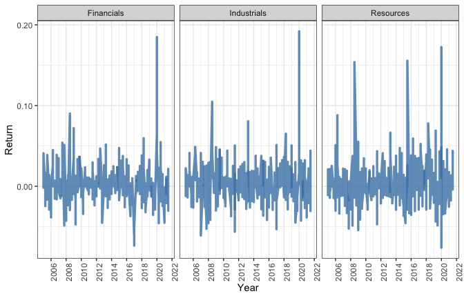
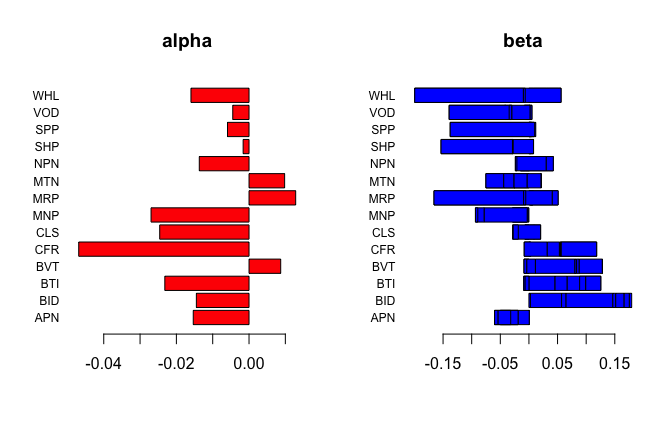

``` r
knitr::opts_chunk$set(echo = TRUE, fig.align = "left", fig.height = 3, fig.pos = "H", fig.width = 5,
                      message=FALSE, warning=FALSE, comment = NA)
library(pacman)
pacman::p_load(fmxdat, Texevier, knitr, kableExtra, tidyverse, dplyr, readr, covFactorModel,
               FinCovRegularization, xts, quantmod,
               lubridate, tbl2xts, corrplot, rmsfuns)

rm(list = ls()) # Cleaning environment:
gc() # garbage collection 
```

# File Overview

This README is intended to guide the reader through the code used in
completing the investigation on the use of factor modeling for
estimating the asset returns covariance matrix. The final PDF document
compiled can be found in this folder, titled “Factor Model”.

Certain sections included here, such as those discussing the process of
uploading and tidying the data, as well as the treatment of missing
values are excluded from the final PDF output, but are included here for
illustration purposes. In addition, much of the output found in this
document, and none of the code, are available in the final PDF.

## Uploading and Tidying Data

``` r
dat_Fac <- read.csv("./data/Factors_New.csv")

dat_Factors <- dat_Fac %>%
    pivot_longer(cols = starts_with("X"), names_to="date", values_drop_na = FALSE) %>%
    pivot_wider(names_from="Indicator.Name") %>%
    mutate_at("date", str_replace, "X", "") %>%
    arrange(date) %>% mutate(date=as.yearqtr(date, format = "%Y Q%q")) %>%
    mutate(Inflation=((CPI-lag(CPI))/lag(CPI))*100) %>% 
    select(-c("CPI", "GDP.Deflator")) #%>%   # previously had experimented with calculating inflation using GDP deflator, decided CPI inflation was better choice.
    #filter(date>"2004 Q4")

### Daily Factors

US_10Yr <- read_rds("./data/bonds_10y.rds")%>%
    filter(Name=="US_10Yr") %>%
    spread(Name, Bond_10Yr) 

comms <- read_rds("./data/comms.rds")
comms <- comms %>%
    filter(Name=="Bcom_Index") %>%
    spread(Name, Price)


VIX <- read_rds("./data/IV.rds")
VIX <- VIX %>%
    filter(Name=="VIX") %>%
    spread(Name, Price)

usdzar <- read_rds("./data/usdzar.rds")
usdzar$Name <- gsub("SouthAfrica_Cncy", "USDZAR", usdzar$Name)
usdzar <- usdzar %>% spread(Name, Price)

### Full (Daily) factors convert to Quarterly
dat_Factors_K <- left_join(US_10Yr, comms, by="date") %>%
  left_join(., VIX, by="date") %>%
  left_join(., usdzar, by="date") %>%   # First, combining the relevant datasets
  mutate(Date=as.yearqtr(date)) %>%     # Second, converting to quarterly
  group_by(Date) %>%                 
  filter(date==max(date)) %>%
  ungroup() %>%
  select(Date, US_10Yr, Bcom_Index, VIX, USDZAR) %>%
  rename(., date=Date) #%>%
  #filter(date>"2004 Q4") 

### Consolidated factors dataset
Factors <- left_join(dat_Factors_K, dat_Factors, by="date")  %>%
  mutate(across(.cols=-c("date", "US_10Yr", "MM.Rate", "Inflation"), .fns = ~log(.+1)-log(lag(.+1)) )) %>% #log differences taken for relevant variables
  mutate(across(.cols=c("US_10Yr", "MM.Rate", "Inflation"), .fns= ~log(.+1))) %>% # where differences not needed to be taken, variables were still converted to log terms
  filter(date<"2021 Q4" & date>"2004 Q4")
```

``` r
new_dat_0 <- read_rds("./data/alsi.rds")

new_dat_0$Tickers <- gsub(" SJ Equity", "", new_dat_0$Tickers)  # to make life easier

# Ticker MNP classified as being in both Resources and Industrials.
new_dat_0 %>% filter(Tickers=="MNP") %>%
  select(Tickers, Superindustryname) %>%
  distinct(Tickers, Superindustryname) %>%
  kable() %>% kable_styling(latex_options = "HOLD_position")
```

<table class="table" style="margin-left: auto; margin-right: auto;">
<thead>
<tr>
<th style="text-align:left;">
Tickers
</th>
<th style="text-align:left;">
Superindustryname
</th>
</tr>
</thead>
<tbody>
<tr>
<td style="text-align:left;">
MNP
</td>
<td style="text-align:left;">
Resources
</td>
</tr>
<tr>
<td style="text-align:left;">
MNP
</td>
<td style="text-align:left;">
Industrials
</td>
</tr>
</tbody>
</table>

``` r
# According to JSE website, MNP's superindustry is industrials .. need to change this.
new_dat_0$Superindustryname[which(new_dat_0$Tickers == "MNP")] <- "Industrials"
# Checking again (with above code) confirms that MNP is now only classified as "Industrials"


# Tidying original data
new_dat <- new_dat_0 %>% 
  select(-c("Short.Name", "J203")) %>%
  mutate(Date=as.yearqtr(date)) %>%   # steps below construct the quarterly dataset to be used 
  group_by(Date) %>%                  # Macro factors only available at (minimum) quarterly frequency
  filter(date==max(date)) %>%
  ungroup() %>% 
  select(Date, Tickers, Return, Superindustryname) %>%
  rename(., date=Date) %>%
  filter(date<"2021 Q4")


T40 <- c("ABG", "AMS", "AGL", "ANG", "APN", "BHP", "BID",   # Creating vector of T40 constituents
         "BVT", "BTI", "CPI", "CLS", "CFR", "DSY", "EXX",
         "FSR", "GLN", "GFI", "GRT", "IMP", "INL", "INP",
         "MNP", "MRP", "MTN", "MCG", "NPN", "NED", "NRP",
         "NPH", "OMU", "PRX", "RNI", "SLM", "SOL", "SHP",
         "SSW", "SBK", "SPP", "VOD", "WHL")

# Final assets dataset
Assets <- new_dat %>% 
  filter(Tickers %in% T40) %>%
  select(-Superindustryname) %>%
  pivot_wider(names_from = Tickers, values_from = Return) 
  
# Separating Assets by industry

Assets_Industrial <- new_dat %>%
    filter(Tickers %in% T40) %>%
    filter(Superindustryname=="Industrials") %>%
    select(date, Tickers, Return) %>%
    pivot_wider(names_from = Tickers, values_from = Return)

Assets_Resources <- new_dat %>%
    filter(Tickers %in% T40) %>%
    filter(Superindustryname=="Resources") %>%
    select(date, Tickers, Return) %>% 
    pivot_wider(names_from = Tickers, values_from = Return) 

Assets_Financials <- new_dat %>%
    filter(Tickers %in% T40) %>%
    filter(Superindustryname=="Financials") %>%
    select(date, Tickers, Return) %>%
    pivot_wider(names_from = Tickers, values_from = Return) 


# Uncomment below to confirm number of observations (67) for each asset, same as factors

#Assets_Financials %>% gather(Tickers, Return, -date) %>% count(., Tickers)

#Assets_Industrial %>% gather(Tickers, Return, -date) %>% count(., Tickers)

#Assets_Resources %>% gather(Tickers, Return, -date) %>% count(., Tickers)

# Uncomment code below to verify that there is no overlap between variables and superindustries.

#colnames(Assets_Financials[, -1]) %in% colnames(Assets_Industrial[, -1])
#colnames(Assets_Financials[, -1]) %in% colnames(Assets_Resources[, -1])
#colnames(Assets_Resources[, -1]) %in% colnames(Assets_Industrial[, -1])
```

# Project Intro: Covariance Matrix Estimation via Macro Factor Modeling

-   using factor models to estimat covariance matrix parameters
-   assume stock returns are driven by a limited set of factors
-   curse of dimensionality, need to reduce the number of parameters.
    Can use factor model

Factor model decomposition for asset returns

With *β*<sub>*i**k*</sub> representing the sensitivity of asset *i* to
factor *k*, (*k* = 1, ..., *K*).

-   trying to explain asset returns in terms of asset exposure wrt
    underlying risk factors.
-   have n=40 stocks, and k=8 macroeconomic factors
-   can use factor model to estimate the variance and covariance of
    stock returns
-   impose that residuals of two assets are uncorrelated
-   if factor model well specified; factor model explains common
    variation between stock returns, what is left is idiosyncratic
    component
-   Macro factor models are a type of explicit factor model vs
-   implicit factor model driven by statistical factors from data.
    Sometimes prefered as it allows data to ‘speak’, telling us what the
    relevant factors are -\> using a factor model useful way of reducing
    number of possible parameters. Assuming what is not explained by
    factor model is idiosyncratic risk, unique to each asset.

Using factor analysis to explain the variation in stock returns for the
T40 index using macroeconomic variables. - Factor models decompose asset
returns into low dimension factors and idiosynchratic residual noise: –
In macro factor models, factors are observable economic time series

For this project I use the T40 returns dataset for stock returns: only
accounting for large cap stocks, which will be more affected by
movements in macroeconomic variables. - Variables had many returns
missing, discarded ones which had more than 60% of observations missing.
- For the rest, a function was called to draw values from the variables
own probability distribution

The Palomar covFactor package was used to estimate alpha and beta
coefficients for the stock returns.

The macroeconomic factors used are still based on the data used for the
practical, namely the: - US and SA 10_Yr bond spreads - VIX volatility
index - Bloomberg commodities index

Macroeconomic factor models use observable economic time series as the
factors.

Factor models decompose the asset returns into an exposure term to some
factors and a residual idiosyncratic component. The resulting covariance
matrix contains a low-rank term corresponding to the factors and another
full-rank term corresponding to the residual component.

These factors can include inflation, economic growth, interest rates, or
exchange rates, among others. Macroeconomic factor models assume that
the random return of each security responds linearly to the
macroeconomic shocks. use observable economic time series as measures of
the pervasive factors in security returns

As in all factor models, each security also has an asset specific return
unrelated to the factors security’s linear sensitivities to the factors
are called the factor betas of the security.

In a macroeconomic factor model, the factors are defined by economic
theory and observed externally to the security returns data

# Exploratory Analysis

## Data and Descriptive Statistics

``` r
# Creating Table with Variable Descriptions
Fac_Names <- colnames(Factors[, -1])
Fac_Desc <- c("US 10 Year Bond Yields", "Bloomberg Commodities Index", "CBOE Volatility Index", "USD/ZAR Spot Price", "SA Money Market Rate", "SA Real Gross Domestic Product", "SA Real Gross Fixed Capital Formation", "Inflation (Consumer Prices)")
Fac_Source <- c("N. Katzke", "N. Katzke", "N. Katzke", "N. Katzke", "IMF International Financial Statistics", "IMF International Financial Statistics", "IMF International Financial Statistics", "IMF International Financial Statistics")

data.frame(Fac_Names, Fac_Desc, Fac_Source) %>% arrange(Fac_Names) %>% kable(caption="Macroeconomic Factors", align="l", col.names = c("Name", "Description", "Source")) #%>%  kable_styling(latex_options = "HOLD_position")
```

<table>
<caption>
Macroeconomic Factors
</caption>
<thead>
<tr>
<th style="text-align:left;">
Name
</th>
<th style="text-align:left;">
Description
</th>
<th style="text-align:left;">
Source
</th>
</tr>
</thead>
<tbody>
<tr>
<td style="text-align:left;">
Bcom_Index
</td>
<td style="text-align:left;">
Bloomberg Commodities Index
</td>
<td style="text-align:left;">
N. Katzke
</td>
</tr>
<tr>
<td style="text-align:left;">
Inflation
</td>
<td style="text-align:left;">
Inflation (Consumer Prices)
</td>
<td style="text-align:left;">
IMF International Financial Statistics
</td>
</tr>
<tr>
<td style="text-align:left;">
MM.Rate
</td>
<td style="text-align:left;">
SA Money Market Rate
</td>
<td style="text-align:left;">
IMF International Financial Statistics
</td>
</tr>
<tr>
<td style="text-align:left;">
Real.GDP
</td>
<td style="text-align:left;">
SA Real Gross Domestic Product
</td>
<td style="text-align:left;">
IMF International Financial Statistics
</td>
</tr>
<tr>
<td style="text-align:left;">
Real.INV
</td>
<td style="text-align:left;">
SA Real Gross Fixed Capital Formation
</td>
<td style="text-align:left;">
IMF International Financial Statistics
</td>
</tr>
<tr>
<td style="text-align:left;">
US_10Yr
</td>
<td style="text-align:left;">
US 10 Year Bond Yields
</td>
<td style="text-align:left;">
N. Katzke
</td>
</tr>
<tr>
<td style="text-align:left;">
USDZAR
</td>
<td style="text-align:left;">
USD/ZAR Spot Price
</td>
<td style="text-align:left;">
N. Katzke
</td>
</tr>
<tr>
<td style="text-align:left;">
VIX
</td>
<td style="text-align:left;">
CBOE Volatility Index
</td>
<td style="text-align:left;">
N. Katzke
</td>
</tr>
</tbody>
</table>

Macroeconomic factors for South Africa were chosen on the basis of their
possible influence in driving asset returns in South Africa. US 10 Year
bond yields were used to quantify the influence of US Monetary Policy
decisions in driving global liquidity. This is based on the direct
relationship between bond yields and interest rates, whereby lower
interest rates depress bond yields and these thus become a less
attractive investment option; potentially leading investors to seek
higher returns in domestic and foreign asset markets. The Bloomberg
commodities index was used to measure the influence that changing
commodity prices may have on asset returns, given that the South African
economy is still influenced to a large extent by fluctuating commodity
prices. The CBOE VIX volatility index was included to account for the
effect that changing risk perceptions may have on domestic asset
returns. Similarly to changes in US long term bond yields, lower risk
perceptions may lead to capital flowing more towards developing
(periphery) and could thus influence South African asset returns. The
USDZAR spot rate was also included as changes in the price of foreign
exchange can influence asset returns through, for example, increasing
the cost of financing outstanding debt, or increasing input costs. The
money market rate was used to represent the domestic monetary policy
stance, this can affect the cost of borrowing for businesses, as well as
changing investor incentives when it comes to investing in asset
markets; both of which can influence returns. Real gross fixed capital
formation was used to account for the level of investment in the economy
for any given quarter. Finally, inflation was measured using the
Consumer Price Index (CPI) and the formula
$Inflation\_{t}=\\frac{CPI\_{t}-CPI\_{t-1}}{CPI\_{t-1}}$. All macro
factors entered the model in log terms, and, in addition, non-stationary
variables were taken as quarterly changes.

Descriptive statistics for the macroeconomic factors can be seen in the
table below.

``` r
# Creating Table with descriptive statistics for Macro Factors
data.frame(pastecs::stat.desc(Factors[, -1], basic=F)) %>% 
  dplyr::mutate_at(c("Real.GDP", "Real.INV"), funs(as.character(signif(., 3)))) %>%
  kable(caption="Summary Statistics: Macro Factors", digits=3, align="l", longtable=TRUE) #%>%  kable_styling(latex_options = "HOLD_position")
```

<table>
<caption>
Summary Statistics: Macro Factors
</caption>
<thead>
<tr>
<th style="text-align:left;">
</th>
<th style="text-align:left;">
US_10Yr
</th>
<th style="text-align:left;">
Bcom_Index
</th>
<th style="text-align:left;">
VIX
</th>
<th style="text-align:left;">
USDZAR
</th>
<th style="text-align:left;">
MM.Rate
</th>
<th style="text-align:left;">
Real.GDP
</th>
<th style="text-align:left;">
Real.INV
</th>
<th style="text-align:left;">
Inflation
</th>
</tr>
</thead>
<tbody>
<tr>
<td style="text-align:left;">
median
</td>
<td style="text-align:left;">
1.250
</td>
<td style="text-align:left;">
0.003
</td>
<td style="text-align:left;">
-0.027
</td>
<td style="text-align:left;">
0.003
</td>
<td style="text-align:left;">
2.019
</td>
<td style="text-align:left;">
0.00873
</td>
<td style="text-align:left;">
0.0109
</td>
<td style="text-align:left;">
0.805
</td>
</tr>
<tr>
<td style="text-align:left;">
mean
</td>
<td style="text-align:left;">
1.274
</td>
<td style="text-align:left;">
-0.005
</td>
<td style="text-align:left;">
0.008
</td>
<td style="text-align:left;">
0.013
</td>
<td style="text-align:left;">
1.988
</td>
<td style="text-align:left;">
0.00441
</td>
<td style="text-align:left;">
0.00326
</td>
<td style="text-align:left;">
0.786
</td>
</tr>
<tr>
<td style="text-align:left;">
SE.mean
</td>
<td style="text-align:left;">
0.038
</td>
<td style="text-align:left;">
0.012
</td>
<td style="text-align:left;">
0.040
</td>
<td style="text-align:left;">
0.008
</td>
<td style="text-align:left;">
0.029
</td>
<td style="text-align:left;">
0.00368
</td>
<td style="text-align:left;">
0.00532
</td>
<td style="text-align:left;">
0.038
</td>
</tr>
<tr>
<td style="text-align:left;">
CI.mean.0.95
</td>
<td style="text-align:left;">
0.077
</td>
<td style="text-align:left;">
0.024
</td>
<td style="text-align:left;">
0.080
</td>
<td style="text-align:left;">
0.017
</td>
<td style="text-align:left;">
0.058
</td>
<td style="text-align:left;">
0.00735
</td>
<td style="text-align:left;">
0.0106
</td>
<td style="text-align:left;">
0.076
</td>
</tr>
<tr>
<td style="text-align:left;">
var
</td>
<td style="text-align:left;">
0.098
</td>
<td style="text-align:left;">
0.010
</td>
<td style="text-align:left;">
0.107
</td>
<td style="text-align:left;">
0.005
</td>
<td style="text-align:left;">
0.058
</td>
<td style="text-align:left;">
0.000907
</td>
<td style="text-align:left;">
0.0019
</td>
<td style="text-align:left;">
0.096
</td>
</tr>
<tr>
<td style="text-align:left;">
std.dev
</td>
<td style="text-align:left;">
0.314
</td>
<td style="text-align:left;">
0.099
</td>
<td style="text-align:left;">
0.326
</td>
<td style="text-align:left;">
0.069
</td>
<td style="text-align:left;">
0.240
</td>
<td style="text-align:left;">
0.0301
</td>
<td style="text-align:left;">
0.0436
</td>
<td style="text-align:left;">
0.310
</td>
</tr>
<tr>
<td style="text-align:left;">
coef.var
</td>
<td style="text-align:left;">
0.246
</td>
<td style="text-align:left;">
-18.243
</td>
<td style="text-align:left;">
41.716
</td>
<td style="text-align:left;">
5.248
</td>
<td style="text-align:left;">
0.121
</td>
<td style="text-align:left;">
6.83
</td>
<td style="text-align:left;">
13.4
</td>
<td style="text-align:left;">
0.394
</td>
</tr>
</tbody>
</table>

For this analysis, only variables in the Top 40 of the JSE, by market
capitalization, were included. This was done to account for the fact
that larger companies will be more exposed to global macroeconomic
factors, relative to those with smaller market caps. The variables
chosen as part of this “T40” are based on the FTSE Russell
classification, as of the end of 2021 Q4 (see \[@FTSE\]). After
subsetting the Top 40 stocks, these were stratified into their
respective super-industries. When constructing the dataset by industry
classification, Mondi PLC (MNP) had the majority of it’s observations
classified as being in resources, rather than the industrial sector the
JSE claims it belongs to. As such, MNP was reclassified as being part of
Industrials. The stocks included, as well as their relevant industries,
can be found in the table below.

``` r
# Creating Descriptive Table of T40 stocks and Industries
new_dat_0 %>% filter(Tickers %in% T40) %>%
  filter(Superindustryname=="Financials") %>%
  distinct(Tickers, Short.Name) %>%
  arrange(Short.Name) %>%
  kable(caption="T40 Constituents: Financials", align="l", col.names = c("Ticker", "Constituent")) #%>% kable_styling(latex_options = "HOLD_position")
```

<table>
<caption>
T40 Constituents: Financials
</caption>
<thead>
<tr>
<th style="text-align:left;">
Ticker
</th>
<th style="text-align:left;">
Constituent
</th>
</tr>
</thead>
<tbody>
<tr>
<td style="text-align:left;">
ABG
</td>
<td style="text-align:left;">
ABSA GROUP LTD
</td>
</tr>
<tr>
<td style="text-align:left;">
CPI
</td>
<td style="text-align:left;">
CAPITEC BANK HOL
</td>
</tr>
<tr>
<td style="text-align:left;">
DSY
</td>
<td style="text-align:left;">
DISCOVERY LTD
</td>
</tr>
<tr>
<td style="text-align:left;">
FSR
</td>
<td style="text-align:left;">
FIRSTRAND LTD
</td>
</tr>
<tr>
<td style="text-align:left;">
GRT
</td>
<td style="text-align:left;">
GROWTHPOINT PROP
</td>
</tr>
<tr>
<td style="text-align:left;">
INL
</td>
<td style="text-align:left;">
INVESTEC LTD
</td>
</tr>
<tr>
<td style="text-align:left;">
INP
</td>
<td style="text-align:left;">
INVESTEC PLC
</td>
</tr>
<tr>
<td style="text-align:left;">
NED
</td>
<td style="text-align:left;">
NEDBANK GROUP
</td>
</tr>
<tr>
<td style="text-align:left;">
NRP
</td>
<td style="text-align:left;">
NEPI ROCKCASTLE
</td>
</tr>
<tr>
<td style="text-align:left;">
OMU
</td>
<td style="text-align:left;">
OLD MUTUAL LTD
</td>
</tr>
<tr>
<td style="text-align:left;">
RNI
</td>
<td style="text-align:left;">
Reinet Investments SCA
</td>
</tr>
<tr>
<td style="text-align:left;">
SLM
</td>
<td style="text-align:left;">
SANLAM LTD
</td>
</tr>
<tr>
<td style="text-align:left;">
SBK
</td>
<td style="text-align:left;">
STANDARD BANK GR
</td>
</tr>
</tbody>
</table>

``` r
new_dat_0 %>% filter(Tickers %in% T40) %>%
  filter(Superindustryname=="Industrials") %>%
  distinct(Tickers, Short.Name) %>%
  arrange(Short.Name) %>%
  kable(caption="T40 Constituents: Industrials", align="l", col.names = c("Ticker", "Constituent")) #%>% kable_styling(latex_options = "HOLD_position")
```

<table>
<caption>
T40 Constituents: Industrials
</caption>
<thead>
<tr>
<th style="text-align:left;">
Ticker
</th>
<th style="text-align:left;">
Constituent
</th>
</tr>
</thead>
<tbody>
<tr>
<td style="text-align:left;">
APN
</td>
<td style="text-align:left;">
ASPEN PHARMACARE
</td>
</tr>
<tr>
<td style="text-align:left;">
BID
</td>
<td style="text-align:left;">
BID CORP LTD
</td>
</tr>
<tr>
<td style="text-align:left;">
BVT
</td>
<td style="text-align:left;">
BIDVEST GROUP
</td>
</tr>
<tr>
<td style="text-align:left;">
BTI
</td>
<td style="text-align:left;">
BRIT AMER TOBACC
</td>
</tr>
<tr>
<td style="text-align:left;">
CLS
</td>
<td style="text-align:left;">
CLICKS GROUP LTD
</td>
</tr>
<tr>
<td style="text-align:left;">
MNP
</td>
<td style="text-align:left;">
MONDI PLC
</td>
</tr>
<tr>
<td style="text-align:left;">
MRP
</td>
<td style="text-align:left;">
MR PRICE GROUP
</td>
</tr>
<tr>
<td style="text-align:left;">
MTN
</td>
<td style="text-align:left;">
MTN GROUP LTD
</td>
</tr>
<tr>
<td style="text-align:left;">
MCG
</td>
<td style="text-align:left;">
MULTICHOICE GROU
</td>
</tr>
<tr>
<td style="text-align:left;">
NPN
</td>
<td style="text-align:left;">
NASPERS LTD-N
</td>
</tr>
<tr>
<td style="text-align:left;">
PRX
</td>
<td style="text-align:left;">
PROSUS NV
</td>
</tr>
<tr>
<td style="text-align:left;">
CFR
</td>
<td style="text-align:left;">
RICHEMONT-DR
</td>
</tr>
<tr>
<td style="text-align:left;">
SHP
</td>
<td style="text-align:left;">
SHOPRITE HLDGS
</td>
</tr>
<tr>
<td style="text-align:left;">
SPP
</td>
<td style="text-align:left;">
SPAR GRP LTD/THE
</td>
</tr>
<tr>
<td style="text-align:left;">
VOD
</td>
<td style="text-align:left;">
VODACOM GROUP
</td>
</tr>
<tr>
<td style="text-align:left;">
WHL
</td>
<td style="text-align:left;">
WOOLWORTHS HLDGS
</td>
</tr>
</tbody>
</table>

``` r
new_dat_0 %>% filter(Tickers %in% T40) %>%
  filter(Superindustryname=="Resources") %>%
  distinct(Tickers, Short.Name) %>%
  arrange(Short.Name) %>%
  kable(caption="T40 Constituents: Resources", align="l", col.names = c("Ticker", "Constituent")) #%>% kable_styling(latex_options = "HOLD_position")
```

<table>
<caption>
T40 Constituents: Resources
</caption>
<thead>
<tr>
<th style="text-align:left;">
Ticker
</th>
<th style="text-align:left;">
Constituent
</th>
</tr>
</thead>
<tbody>
<tr>
<td style="text-align:left;">
AGL
</td>
<td style="text-align:left;">
ANGLO AMER PLC
</td>
</tr>
<tr>
<td style="text-align:left;">
AMS
</td>
<td style="text-align:left;">
ANGLO AMERICAN P
</td>
</tr>
<tr>
<td style="text-align:left;">
ANG
</td>
<td style="text-align:left;">
ANGLOGOLD ASHANT
</td>
</tr>
<tr>
<td style="text-align:left;">
BHP
</td>
<td style="text-align:left;">
BHP GROUP PLC
</td>
</tr>
<tr>
<td style="text-align:left;">
EXX
</td>
<td style="text-align:left;">
EXXARO RESOURCES
</td>
</tr>
<tr>
<td style="text-align:left;">
GLN
</td>
<td style="text-align:left;">
GLENCORE PLC
</td>
</tr>
<tr>
<td style="text-align:left;">
GFI
</td>
<td style="text-align:left;">
GOLD FIELDS LTD
</td>
</tr>
<tr>
<td style="text-align:left;">
IMP
</td>
<td style="text-align:left;">
IMPALA PLATINUM
</td>
</tr>
<tr>
<td style="text-align:left;">
NPH
</td>
<td style="text-align:left;">
NORTHAM PLATINUM
</td>
</tr>
<tr>
<td style="text-align:left;">
SOL
</td>
<td style="text-align:left;">
SASOL LTD
</td>
</tr>
<tr>
<td style="text-align:left;">
SSW
</td>
<td style="text-align:left;">
SIBANYE STILLWAT
</td>
</tr>
</tbody>
</table>

### Treatment of Missing Values

The code below was run in order to check if there were missing values in
the asset returns dataset, with column “n” representing the number of
missing values.

``` r
# Checking number of NA's for each asset
data.frame(colSums(is.na(Assets[, -1])))%>% kable(caption="Assets Missing Values", align="l", col.names = "n") #%>% kable_styling(latex_options = "HOLD_position") 
```

<table>
<caption>
Assets Missing Values
</caption>
<thead>
<tr>
<th style="text-align:left;">
</th>
<th style="text-align:left;">
n
</th>
</tr>
</thead>
<tbody>
<tr>
<td style="text-align:left;">
AGL
</td>
<td style="text-align:left;">
0
</td>
</tr>
<tr>
<td style="text-align:left;">
BHP
</td>
<td style="text-align:left;">
0
</td>
</tr>
<tr>
<td style="text-align:left;">
CFR
</td>
<td style="text-align:left;">
0
</td>
</tr>
<tr>
<td style="text-align:left;">
SOL
</td>
<td style="text-align:left;">
0
</td>
</tr>
<tr>
<td style="text-align:left;">
SBK
</td>
<td style="text-align:left;">
0
</td>
</tr>
<tr>
<td style="text-align:left;">
MTN
</td>
<td style="text-align:left;">
0
</td>
</tr>
<tr>
<td style="text-align:left;">
FSR
</td>
<td style="text-align:left;">
0
</td>
</tr>
<tr>
<td style="text-align:left;">
ABG
</td>
<td style="text-align:left;">
0
</td>
</tr>
<tr>
<td style="text-align:left;">
GFI
</td>
<td style="text-align:left;">
0
</td>
</tr>
<tr>
<td style="text-align:left;">
IMP
</td>
<td style="text-align:left;">
0
</td>
</tr>
<tr>
<td style="text-align:left;">
SLM
</td>
<td style="text-align:left;">
0
</td>
</tr>
<tr>
<td style="text-align:left;">
ANG
</td>
<td style="text-align:left;">
0
</td>
</tr>
<tr>
<td style="text-align:left;">
NPN
</td>
<td style="text-align:left;">
0
</td>
</tr>
<tr>
<td style="text-align:left;">
BVT
</td>
<td style="text-align:left;">
0
</td>
</tr>
<tr>
<td style="text-align:left;">
AMS
</td>
<td style="text-align:left;">
0
</td>
</tr>
<tr>
<td style="text-align:left;">
NED
</td>
<td style="text-align:left;">
0
</td>
</tr>
<tr>
<td style="text-align:left;">
INP
</td>
<td style="text-align:left;">
0
</td>
</tr>
<tr>
<td style="text-align:left;">
WHL
</td>
<td style="text-align:left;">
0
</td>
</tr>
<tr>
<td style="text-align:left;">
EXX
</td>
<td style="text-align:left;">
0
</td>
</tr>
<tr>
<td style="text-align:left;">
APN
</td>
<td style="text-align:left;">
0
</td>
</tr>
<tr>
<td style="text-align:left;">
INL
</td>
<td style="text-align:left;">
0
</td>
</tr>
<tr>
<td style="text-align:left;">
SHP
</td>
<td style="text-align:left;">
0
</td>
</tr>
<tr>
<td style="text-align:left;">
GRT
</td>
<td style="text-align:left;">
0
</td>
</tr>
<tr>
<td style="text-align:left;">
SPP
</td>
<td style="text-align:left;">
0
</td>
</tr>
<tr>
<td style="text-align:left;">
DSY
</td>
<td style="text-align:left;">
0
</td>
</tr>
<tr>
<td style="text-align:left;">
CLS
</td>
<td style="text-align:left;">
0
</td>
</tr>
<tr>
<td style="text-align:left;">
MRP
</td>
<td style="text-align:left;">
0
</td>
</tr>
<tr>
<td style="text-align:left;">
CPI
</td>
<td style="text-align:left;">
0
</td>
</tr>
<tr>
<td style="text-align:left;">
NPH
</td>
<td style="text-align:left;">
0
</td>
</tr>
<tr>
<td style="text-align:left;">
MNP
</td>
<td style="text-align:left;">
10
</td>
</tr>
<tr>
<td style="text-align:left;">
BTI
</td>
<td style="text-align:left;">
15
</td>
</tr>
<tr>
<td style="text-align:left;">
VOD
</td>
<td style="text-align:left;">
17
</td>
</tr>
<tr>
<td style="text-align:left;">
SSW
</td>
<td style="text-align:left;">
32
</td>
</tr>
<tr>
<td style="text-align:left;">
GLN
</td>
<td style="text-align:left;">
35
</td>
</tr>
<tr>
<td style="text-align:left;">
BID
</td>
<td style="text-align:left;">
45
</td>
</tr>
<tr>
<td style="text-align:left;">
NRP
</td>
<td style="text-align:left;">
50
</td>
</tr>
<tr>
<td style="text-align:left;">
RNI
</td>
<td style="text-align:left;">
51
</td>
</tr>
<tr>
<td style="text-align:left;">
OMU
</td>
<td style="text-align:left;">
53
</td>
</tr>
<tr>
<td style="text-align:left;">
MCG
</td>
<td style="text-align:left;">
56
</td>
</tr>
<tr>
<td style="text-align:left;">
PRX
</td>
<td style="text-align:left;">
58
</td>
</tr>
</tbody>
</table>

Removing the data was done as in the chunk below. Firstly, for each
industry, assets which had more than 70% of observations missing were
dropped. The reason for this is that the second step involves imputing
the missing returns from the distribution of asset i’s returns. Having a
high proportion of missing observations would inevitably lead to biased
results from using the “missingreturns” function.

``` r
# Cleaning data and creating log returns series
source("./code/missingreturns.R")

# Assets split by industry
## First select assets with less than 30% of observations missing. Then impute missing values using the above (sourced) function.
## Finally, take logs of the returns, use log(x+1) to account for periods with zero returns.

Financials_clean <- Assets_Financials %>% 
  select(where(~mean(is.na(.))< 0.7)) %>% 
  impute_missing_returns(., impute_returns_method = "Drawn_Distribution_Own", Seed = as.numeric(format( Sys.time(), "%Y%d%H%M"))) %>%
  mutate(across(.cols=-date, .fns=~log(.+1))) 

Industrial_clean <- Assets_Industrial %>% 
  select(where(~mean(is.na(.))< 0.7)) %>% 
  impute_missing_returns(., impute_returns_method = "Drawn_Distribution_Own", Seed = as.numeric(format( Sys.time(), "%Y%d%H%M"))) %>%
  mutate(across(.cols=-date, .fns=~log(.+1))) 

Resources_clean <- Assets_Resources %>% 
  select(where(~mean(is.na(.))< 0.7)) %>%
  impute_missing_returns(., impute_returns_method = "Drawn_Distribution_Own", Seed = as.numeric(format( Sys.time(), "%Y%d%H%M"))) %>%
  mutate(across(.cols=-date, .fns=~log(.+1))) 
```

From the table below, one can see the 5 tickers that dropped out of the
final asset returns dataset. Tickers NRP, OMU, RNI, MCG, PRX dropping
out, with the former 3 being part of the financials group, and the
latter 2 belonging to industrials.

``` r
# Checking which assets dropped out

T40[!T40%in%colnames(Assets[, -1] %>% select(where(~mean(is.na(.))< 0.7)))] %>% kable(caption="Assets Missing Variables", align="l", col.names = "Tickers") #%>% kable_styling(latex_options = "HOLD_position")
```

<table>
<caption>
Assets Missing Variables
</caption>
<thead>
<tr>
<th style="text-align:left;">
Tickers
</th>
</tr>
</thead>
<tbody>
<tr>
<td style="text-align:left;">
MCG
</td>
</tr>
<tr>
<td style="text-align:left;">
NRP
</td>
</tr>
<tr>
<td style="text-align:left;">
OMU
</td>
</tr>
<tr>
<td style="text-align:left;">
PRX
</td>
</tr>
<tr>
<td style="text-align:left;">
RNI
</td>
</tr>
</tbody>
</table>

## Data Visualization

This section presents figures for the relevant macroeconomic factors,
and the asset returns (disaggregated) by industry.

``` r
p.US <- Factors %>% mutate(date=as.Date(date)) %>% ggplot() + geom_line(aes(date, US_10Yr)) + labs(x="", y="", title="US 10Year") + theme_bw()

fmxdat::finplot(p.US, x.vert = T, x.date.type = "%Y", x.date.dist="2 year", y.comma.sep=TRUE)
```

<div class="figure" style="text-align: left">


<p class="caption">
US Long-Term Bond Yields
</p>

</div>

``` r
p.USDZAR <- Factors %>% mutate(date=as.Date(date)) %>% ggplot() + geom_line(aes(date, USDZAR)) + labs(x="", y="", title="USDZAR") + theme_bw()

fmxdat::finplot(p.USDZAR, x.vert = T, x.date.type = "%Y", x.date.dist="2 year", y.comma.sep=TRUE)
```

<div class="figure" style="text-align: left">


<p class="caption">
USDZAR Spot Price
</p>

</div>

``` r
p.VIX <- Factors %>% mutate(date=as.Date(date)) %>% ggplot() + geom_line(aes(date, VIX)) + labs(x="", y="", title="VIX Volatility") + theme_bw()

fmxdat::finplot(p.VIX, x.vert = T, x.date.type = "%Y", x.date.dist="2 year", y.comma.sep=TRUE)
```

<div class="figure" style="text-align: left">


<p class="caption">
CBOE VIX Volatility Index
</p>

</div>

``` r
p.Bcom_Index <- Factors %>% mutate(date=as.Date(date)) %>% ggplot() + geom_line(aes(date, Bcom_Index)) + labs(x="", y="", title="Commodity Price") + theme_bw()

fmxdat::finplot(p.Bcom_Index, x.vert = T, x.date.type = "%Y", x.date.dist="2 year", y.comma.sep=TRUE)
```

<div class="figure" style="text-align: left">


<p class="caption">
Bloomberg Commodity Price Index
</p>

</div>

``` r
p.MM.Rate <- Factors %>% mutate(date=as.Date(date)) %>% ggplot() + geom_line(aes(date, MM.Rate)) + labs(x="", y="", title="SA Money Market Rate") + theme_bw()

fmxdat::finplot(p.MM.Rate, x.vert = T, x.date.type = "%Y", x.date.dist="2 year", y.comma.sep=TRUE)
```

<div class="figure" style="text-align: left">


<p class="caption">
South Africa Money Market Rate
</p>

</div>

``` r
p.Real.GDP <- Factors %>% mutate(date=as.Date(date)) %>% ggplot() + geom_line(aes(date, Real.GDP)) + labs(x="", y="", title="SA Real GDP") + theme_bw()

fmxdat::finplot(p.Real.GDP, x.vert = T, x.date.type = "%Y", x.date.dist="2 year", y.comma.sep=TRUE)
```

<div class="figure" style="text-align: left">


<p class="caption">
South Africa Real GDP
</p>

</div>

``` r
p.Real.Inv <- Factors %>% mutate(date=as.Date(date)) %>% ggplot() + geom_line(aes(date, Real.INV)) + labs(x="", y="", title="SA Real Investment") + theme_bw()

fmxdat::finplot(p.Real.Inv, x.vert = T, x.date.type = "%Y", x.date.dist="2 year", y.comma.sep=TRUE)
```

<div class="figure" style="text-align: left">


<p class="caption">
South Africa Real Gross Fixed Capital Formation
</p>

</div>

``` r
p.CPI <- Factors %>% mutate(date=as.Date(date)) %>% ggplot() + geom_line(aes(date, Inflation)) + labs(x="", y="", title="SA Inflation") + theme_bw()

fmxdat::finplot(p.CPI, x.vert = T, x.date.type = "%Y", x.date.dist="2 year", y.comma.sep=TRUE)
```

<div class="figure" style="text-align: left">


<p class="caption">
South Africa Consumer Price Inflation
</p>

</div>

``` r
p.Indus <- new_dat %>%
    filter(Tickers %in% T40) %>%
    mutate(date=as.Date(date)) %>%
    ggplot() + geom_line(aes(date, Return), color="steelblue", size=1.2, alpha=0.8) + theme_bw() + fmxdat::fmx_cols() + facet_wrap(~Superindustryname) + labs(x="Year")

fmxdat::finplot(p.Indus, x.vert = T, x.date.type = "%Y", x.date.dist="2 year", y.comma.sep=TRUE)
```

<div class="figure" style="text-align: left">


<p class="caption">
Asset Returns by Industry
</p>

</div>

# Empirical Analysis

## Methodology

8 Macro Factors and 40 Assets

## Model Estimation

``` r
Factors_xts <- Factors %>% 
  tbl2xts::tbl_xts()

Financials_xts <- Financials_clean %>% tbl_xts()
Industrial_xts <- Industrial_clean %>% tbl_xts()
Resources_xts <- Resources_clean %>% tbl_xts()
```

``` r
FM_Fin <- covFactorModel::factorModel(Financials_xts, type="Macro", econ_fact = Factors_xts, rtn_Sigma = TRUE)

covmat_Fin <- FM_Fin$Sigma  # Covariance Matrix
FM_Res_Fin <- FM_Fin$residual
```

``` r
par(mfrow = c(1, 2))
barplot(FM_Fin$alpha, horiz = TRUE, 
        main = "alpha", col = "red", cex.names = 0.75, las = 1)
barplot(t(FM_Fin$beta), horiz = TRUE, 
        main = "beta", col = "blue", cex.names = 0.75, las = 1)
```


``` r
FM_Ind <- covFactorModel::factorModel(Industrial_xts, type="Macro", econ_fact = Factors_xts, rtn_Sigma = TRUE)

covmat_Ind <- FM_Ind$Sigma  # Covariance Matrix
FM_Res_Ind <- FM_Ind$residual
```

``` r
par(mfrow = c(1, 2))
barplot(FM_Ind$alpha, horiz = TRUE, 
        main = "alpha", col = "red", cex.names = 0.75, las = 1)
barplot(t(FM_Ind$beta), horiz = TRUE, 
        main = "beta", col = "blue", cex.names = 0.75, las = 1)
```



``` r
FM_Res <- covFactorModel::factorModel(Resources_xts, type="Macro", econ_fact = Factors_xts, rtn_Sigma = TRUE)

covmat_Res <- FM_Res$Sigma  # Covariance Matrix
FM_Res_Res <- FM_Res$residual
```

``` r
par(mfrow = c(1, 2))
barplot(FM_Res$alpha, horiz = TRUE, 
        main = "alpha", col = "red", cex.names = 0.75, las = 1)
barplot(t(FM_Res$beta), horiz = TRUE, 
        main = "beta", col = "blue", cex.names = 0.75, las = 1)
```


# Conclusion

# References

# Appendices
